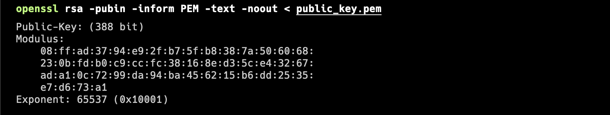
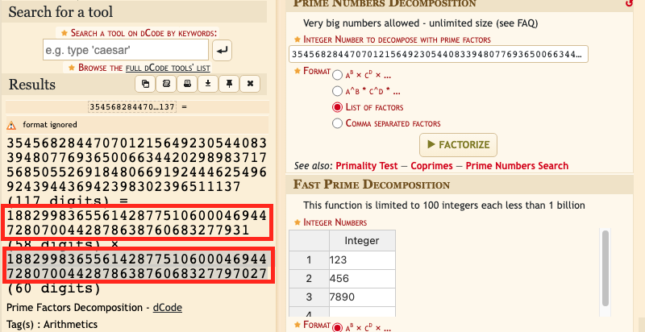
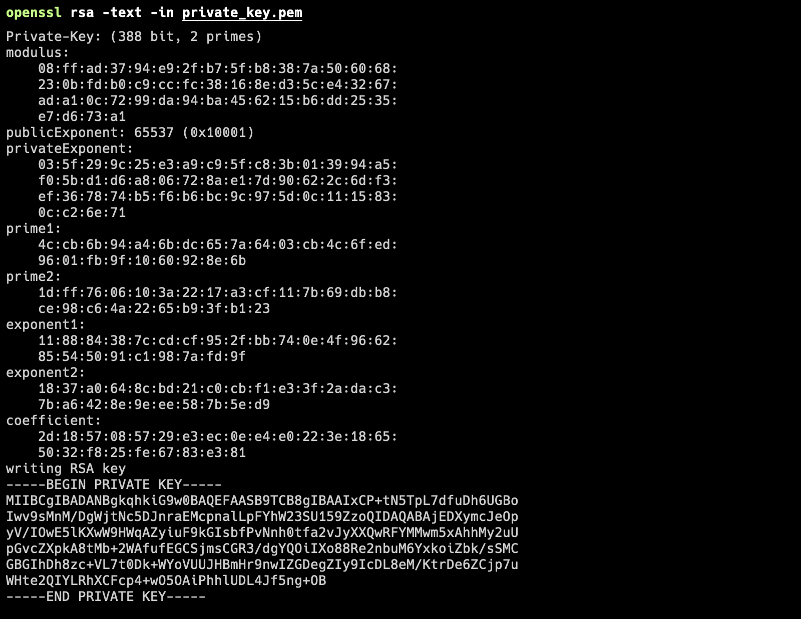
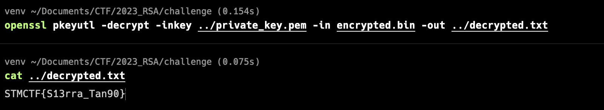

# STMCTF23 QUESTION

## Information
### Challenge name: 

`RSA-Recovery`

### Categories:
 - `Crypto`

### Challenge message:
```
TR:
Elindeki dosyanın bir RSA Private Key ile şifrelendiğini düşünüyorum ve bu anahtarın eşi olduğunu düşündüğüm Public Key'i de elde etmeyi bir şekilde başardım fakat tam bu nokta tıkandım ve ilerliyemiyorum. Dosyayı deşifre etmekte bana yardım edebilir misin?

EN:
I think the file presented to you is encrypted with an RSA Private Key, and I somehow managed to obtain the Public Key, which I think is the pair of this key, but I am stuck at this point and cannot proceed. Can you help me decipher the file?
```

## Solution - TR:

Elimizde 2 tane dosya mevcut bunlardan bir tanesi şifrelenmiş bir dosya diğeri ise bir Public Key. İlk olarak openssl ile Public Key'in modulus ve exponent değerlerine bakalım.



Ekran çıktısında Modulus (n) değerinin oldukça küçük bir sayı olduğu anlaşılmaktadır ayrıcak e'nin de 65537 seçildiği görülmektedir. Pöpüler bir site olan www.dcode.fr adresinden bu n (modulus) sayısının çarpanlarına ayrılıp ayrılamadığını kontrol edelim. Biliyoruz ki RSA n sayısı iki tane asal sayı olan p ve q'nun çarpımından elde edilmektedir. Eğer n'yi çarpanlarına ayırarak p ve q sayılarını bulabilirsek Private Key'i üretmek için gerekli olan diğer değerleri de bulabiliriz.



Evet;
p = 1882998365561428775106000469447280700442878638760683277931
q = 188299836556142877510600046944728070044287863876068327797027
e = 65537
Burdan sonra yapılması gereken phi =  (p - 1) * (q - 1) ve private exponent olan d = e ^ (-1) (mod phi) değerlerini hesaplayarak private key'i üretmek olacaktır. Bunun içinde aşağıdaki python script'i kullanılabilir.

```
#!/usr/bin/env python

from Crypto.PublicKey import RSA
from Crypto.Cipher import PKCS1_OAEP

def invmod(a, m):
   g, x, y = egcd(a, m)
   if g != 1:
       raise ValueError('modular inverse does not exist')
   else:
       return x % m

def egcd(a, b):
   lastremainder, remainder = abs(a), abs(b)
   x, lastx, y, lasty = 0, 1, 1, 0
   while remainder:
       lastremainder, (quotient, remainder) = remainder, divmod(lastremainder, remainder)
       x, lastx = lastx - quotient*x, x
       y, lasty = lasty - quotient*y, y
   return lastremainder, lastx, lasty

def generate_keys():
   # Manually specify your prime numbers p and q
   q = 188299836556142877510600046944728070044287863876068327797027
   p = 1882998365561428775106000469447280700442878638760683277931

   # Calculate n (modulus)
   # "n" is factorizable in effective amout of time
   n = p * q

   # Calculate the totient 
   phi = (p - 1) * (q - 1)

   # Choose an encryption exponent (e)
   e = 65537  # A common choice

   # Calculate the private exponent (d)
   d = invmod(e, phi)
   
   print(f'p   = {p}')
   print(f'q   = {q}')
   print(f'n   = {n}')
   print(f'phi = {phi}')
   print(f'e   = {e}')
   print(f'd   = {d}')

   # Create an RSA key object with the specified parameters
   rsa_key = RSA.construct((n, e, d, p, q))

   # Export the public and private keys to PEM format
   private_pem = rsa_key.export_key()
   public_pem = rsa_key.publickey().export_key()

   # Save the keys to files
   with open("private_key.pem", "wb") as private_file:
       private_file.write(private_pem)

   with open("public_key.pem", "wb") as public_file:
      public_file.write(public_pem)

if __name__ == "__main__":
   generate_keys()
```

Elde ettiğimiz Private Key dosyasına bir göz atalım



Şimdi bu Private Key'i kullanarak bize verilen decrypted.txt dosyasını openssl kullanarak açalım.



---

## Solution - EN:
