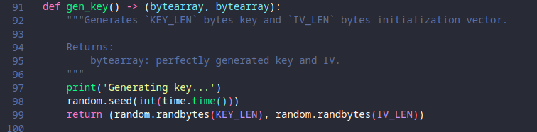

# STMCTF23 QUESTION

## Information
### Challenge name: 

`last encryption bender 2`

### Categories:
 - `crypto`

### Challenge message:
```
TR:
Hüsamettin, geçen sene olduğu gibi kendi yazdığı şifreleme betiği ile kendisi için çok önemli bir Linux çalıştırılabilir dosyasını şifrelemiş fakat şifreyi kaybetmiş. Sizden yardım bekliyor!

EN:
Just like last year, Hüsamettin encrypted a very important Linux executable file with the encryption script he wrote, but lost the password again. He's waiting for your help!
```

## Solution:

Soruda verilen python kodu incelendiğinde dosya şifrelenirken üretilen parolanın, o günün zamanını (datetime) kullandığı görülür:



aynı seed atandıktan sonra aynı parola ve IV'yi oluşturmak mümkün olduğundan tahmin edilmeye çalışılır.

Kod incelenmeye devam edildiğinde şifrelenmiş dosyanın ilk 16 byte'lık kısmının IV olduğu görülür. Aynı IV'yi elde etmek için brute force kullanılacaktır.

Python dosyasının başında kodun 5 Ocak 2023 olduğu verilmiştir. O halde şifrelenen dosya da bu tarihten sonra şifrelenmiştir.

```
import random
import time

# 5 Ocak 2023
START_EPOCH = 1672876800
KEY_LEN = 32
IV_LEN = 16
ACTUAL_IV = bytes.fromhex('e4eeb3d17fa0103118bd75718e8956f3')

for i in range(START_EPOCH, int(time.time())):
    random.seed(i)
    key = random.randbytes(KEY_LEN)
    iv = random.randbytes(IV_LEN)
    if iv == ACTUAL_IV:
        print(f'KEY = {key.hex()}')
        print(f'IV = {iv.hex()}')
        break
```

Script bittiğinde parolayı gösterir:
```
KEY = 795c1246a7bc3f7949acae9263ae513c4246b808e08df659a3d969b360de6d5f
IV = e4eeb3d17fa0103118bd75718e8956f3
```

Bu parola ile dosya çözülür:

    $ python lock.py decrypt --file flag.encrypted --key 795c1246a7bc3f7949acae9263ae513c4246b808e08df659a3d969b360de6d5f

ELF dosyası çalıştırılır ve flag programın çıktısıdır:

    $ chmod +x flag && ./flag 


