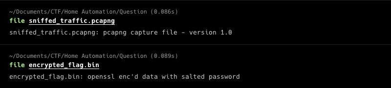
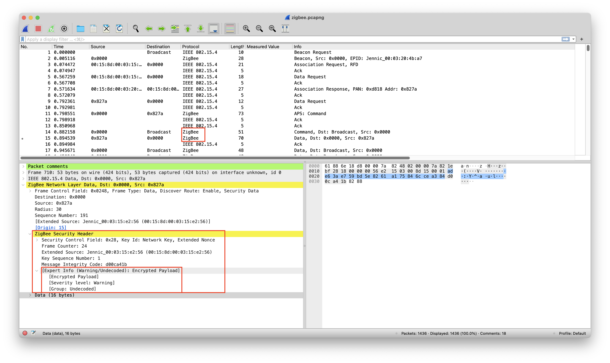
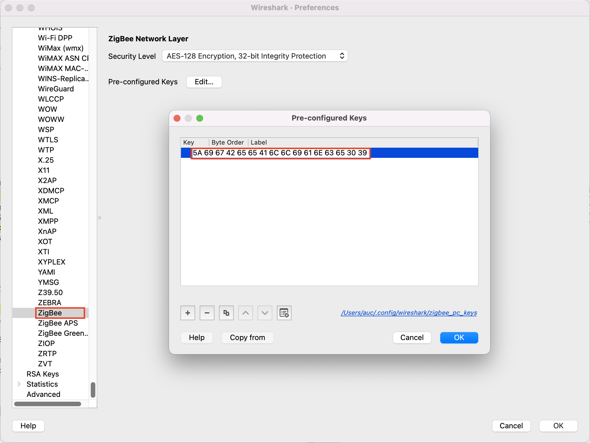
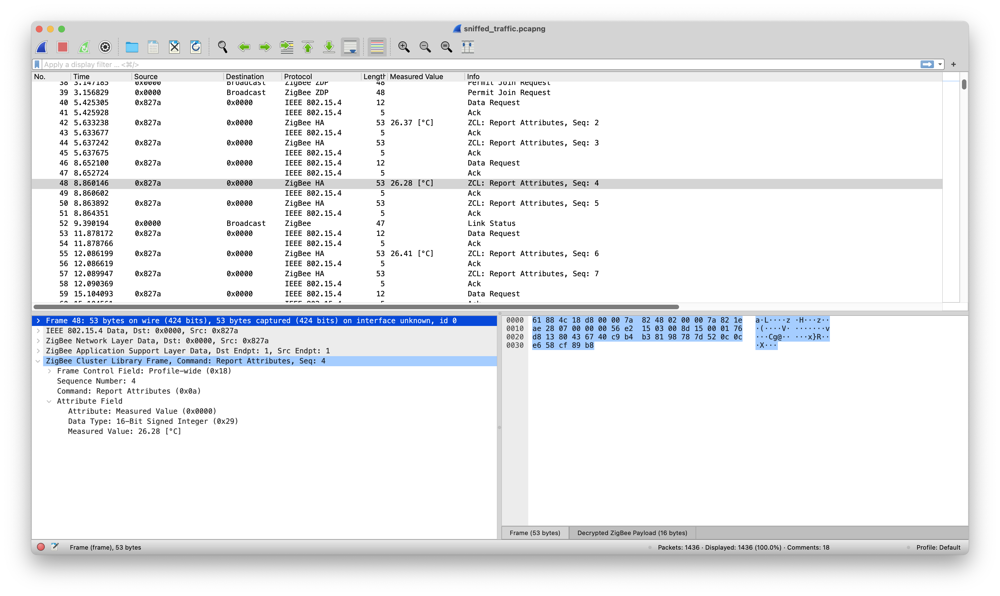
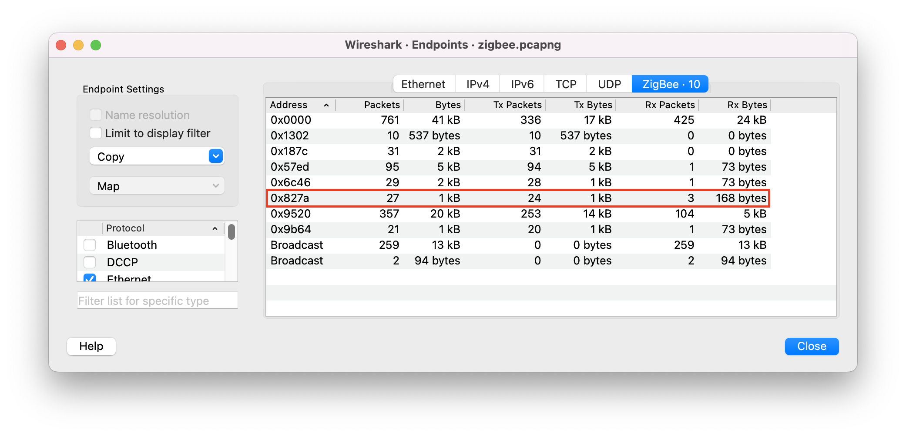
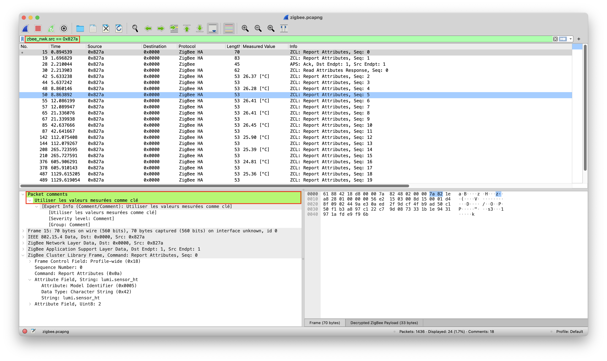
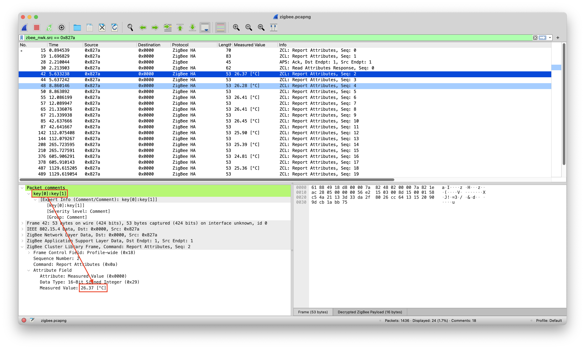
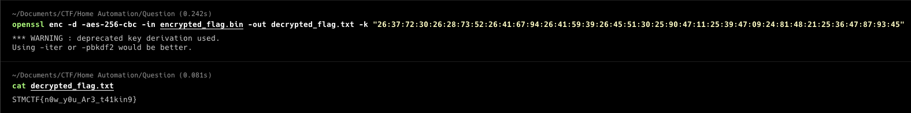

# STMCTF23 QUESTION

## Information
### Challenge name: 

`Ev Otomasyonu`

### Categories:
 - `Forensic`

### Challenge message:
```
TR:
Yasa dışı bir grubun kapalı kanallar üzerinden haberleştiği konusundan bir istihbarat aldık. Elimizdeki şifrelenmiş dosyayı açmak için gerekli olan bilgilerin dinlediğimiz trafik içine saklandığını düşünüyoruz, bu konuda bize yardımcı olabilir misin?

EN:
To have received intelligence that an illegal group is communicating through closed channels. We think that the information required to open the encrypted file we have is hidden in the traffic we listen to. Can you help us with this?
```

## Solution - TR:

Elimizde dosyalara file komutuyla baktığımızda tanımlamada verilenden farklı bir durumla karşılaşmıyoruz. 



O zaman sniffed_traffic.pcapng dosyasını Wireshark ile açalım ve içeriği hakkında bilgi edinmeye çalışalım.Dosyayı incelediğimizde yakalanan trafiğin bir ZigBee networküne ait olduğu görülmektedir, Wireshark otomatik olarak trafiği bizim için tanımlıyor. Paletlerin içerisine biraz daha daldıkça trafiğin şifrelenmiş olduğu ortaya çıkmaktadır. Bu noktada ZigBee ağlar ve güvenliği ile ilgili yapılacak bir araştırma sonucu ZigBee Default Global Trust Center Link Key olarak bilinen bir anahtarın internet üzerinden ulaşılabilir olduğu ortaya çıkmaktadır. [ZigBee Security Basics](https://research.kudelskisecurity.com/2017/11/08/zigbee-security-basics-part-2/).
```
A default global trust center link key defined by the ZigBee Alliance. It has a default value of 5A 69 67 42 65 65 41 6C 6C 69 61 6E 63 65 30 39 (ZigBeeAlliance09) and is used or supported by the device if no other link key is specified by the application at the time of joining.
```



Bu anahtarı Wireshark üzerine tanımlayarak mevcut tarfik üzerinde etkisi var mı yok mu bir bakalım.



Görüldüğü gibi Wireshark otomatik olarak bizim için bütün trafiği encrypt etti. 



Wireshark'ın yeteneklerinden faydalanarak, bu ZigBee ağındaki endpointlerin bir listesini çıkartığımızda 7 farklı sensör ve bir hub'dan oluşan bir ZigBee ağı olduğu anlaşılmaktadır.



Paket sayısı çok fazla olduğu için ben sensörleri tektek filtreleyerek incelemeyi seçtim ve 0x827a adresli sensörün gönderdiği paketlere bazı açıklamalar eklendiğini fark ettim. Aslında bu açıklamalara trafik şifreliyken de ulaşılabilir çünkü bu açıklamalar ZigBee'nin bir özelliği değilde paketlere sonradan eklenen kısımlardır. Neyse, ilk paketti ne yazdığını anlamak için girilen açıklamayı google.translate'e verdiğimde `Utiliser les valeurs mesurées comme clé | Use measured values as key` olduğu görülmektedir.



Bu noktadan sonra herpaketi tek tek gezerek ona verilen açıklama ve Measured Value değerlerini kullanarak bir anahtar elde ettim. `26:37:72:30:26:28:73:52:26:41:67:94:26:41:59:39:26:45:51:30:25:90:47:11:25:39:47:09:24:81:48:21:25:36:47:87:93:45`



Son adımda bu anahtarı openssl ile kullanarak (açıklamalarda AES 256 CBC modunda olduğu söylenmişti) elimdeki şifreli dosyayı açmaya çalıştımtım.

`openssl enc -d -aes-256-cbc -in Question/encrypted_flag.bin -out decrypted_flag.txt -k "26:37:72:30:26:28:73:52:26:41:67:94:26:41:59:39:26:45:51:30:25:90:47:11:25:39:47:09:24:81:48:21:25:36:47:87:93:45"`



---

## Solution - EN:
