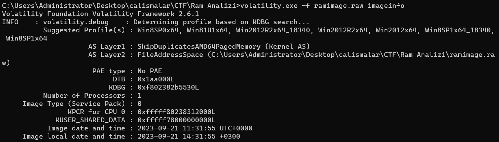
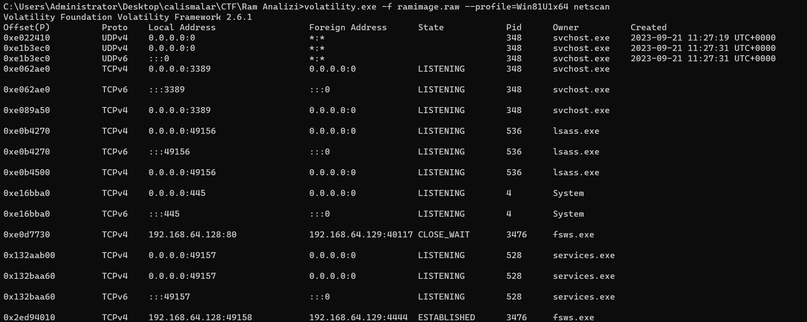

# STMCTF23 QUESTION

## Information
### Challenge name: 

`ram_analizi`

### Categories:
 - `forensic`

### Challenge message:
```
TR:
Reverse shell alınan IP adresi nedir?
EN:
What is the IP address that reverse shell gathered from?

TR:
Reverse shell alınan port nedir?
EN:
What is the port that reverse shell gathered from?

TR:
Tetiklenen işlemin PID numarası nedir?
EN:
What is the triggered process PID number?

TR:
Tetiklenen işlem ismi nedir?
EN:
What is the triggered process name?
```
---

## Solution - TR:

İlk olarak RAM imajı hakkında bilgi almak için imageinfo komutunu çalıştırıyoruz. 



Yapılan bağlantıları tespit etmek için netscan komutu çalıştırılmaktadır. 



Reverse shell alınan processler State olarak Established olan processler incelenerek aşağıdaki bilgiler elde edilmiştir:

0x2ed94010         TCPv4    192.168.64.128:49158           192.168.64.129:4444  ESTABLISHED      3476     fsws.exe

TR:
Reverse shell alınan IP adresi nedir?

İlk olarak RAM imajı hakkında bilgi almak için imageinfo komutunu çalıştırıyoruz. 


Yapılan bağlantıları tespit etmek için netscan komutu çalıştırılmaktadır. 


Reverse shell alınan processler State olarak Established olan processler incelenerek aşağıdaki bilgiler elde edilmiştir:

0x2ed94010         TCPv4    192.168.64.128:49158           192.168.64.129:4444  ESTABLISHED      3476     fsws.exe

TR:
Reverse shell alınan port nedir?

İlk olarak RAM imajı hakkında bilgi almak için imageinfo komutunu çalıştırıyoruz. 


Yapılan bağlantıları tespit etmek için netscan komutu çalıştırılmaktadır. 


Reverse shell alınan processler State olarak Established olan processler incelenerek aşağıdaki bilgiler elde edilmiştir:

0x2ed94010         TCPv4    192.168.64.128:49158           192.168.64.129:4444  ESTABLISHED      3476     fsws.exe

TR:
Tetiklenen işlemin PID numarası nedir?

İlk olarak RAM imajı hakkında bilgi almak için imageinfo komutunu çalıştırıyoruz. 


Yapılan bağlantıları tespit etmek için netscan komutu çalıştırılmaktadır. 


Reverse shell alınan processler State olarak Established olan processler incelenerek aşağıdaki bilgiler elde edilmiştir:

0x2ed94010         TCPv4    192.168.64.128:49158           192.168.64.129:4444  ESTABLISHED      3476     fsws.exe

TR:
Tetiklenen işlem ismi nedir?

İlk olarak RAM imajı hakkında bilgi almak için imageinfo komutunu çalıştırıyoruz. 


Yapılan bağlantıları tespit etmek için netscan komutu çalıştırılmaktadır. 


Reverse shell alınan processler State olarak Established olan processler incelenerek aşağıdaki bilgiler elde edilmiştir:

0x2ed94010         TCPv4    192.168.64.128:49158           192.168.64.129:4444  ESTABLISHED      3476     fsws.exe


---

## Solution - EN:

EN:
What is the IP address that reverse shell gathered from?

First, we run the imageinfo command to get information about the RAM image.


The netscan command is run to detect the connections made.


The following information was obtained by examining the processes received in reverse shell and the processes Established as State:

0x2ed94010 TCPv4 192.168.64.128:49158 192.168.64.129:4444 ESTABLISHED 3476 fsws.exe

EN:
What is the port that reverse shell gathered from?

First, we run the imageinfo command to get information about the RAM image.


The netscan command is run to detect the connections made.


The following information was obtained by examining the processes received in reverse shell and the processes Established as State:

0x2ed94010 TCPv4 192.168.64.128:49158 192.168.64.129:4444 ESTABLISHED 3476 fsws.exe

EN:
What is the triggered process PID number?

First, we run the imageinfo command to get information about the RAM image.


The netscan command is run to detect the connections made.


The following information was obtained by examining the processes received in reverse shell and the processes Established as State:

0x2ed94010 TCPv4 192.168.64.128:49158 192.168.64.129:4444 ESTABLISHED 3476 fsws.exe

EN:
What is the triggered process name?

First, we run the imageinfo command to get information about the RAM image.


The netscan command is run to detect the connections made.


The following information was obtained by examining the processes received in reverse shell and the processes Established as State:

0x2ed94010 TCPv4 192.168.64.128:49158 192.168.64.129:4444 ESTABLISHED 3476 fsws.exe
