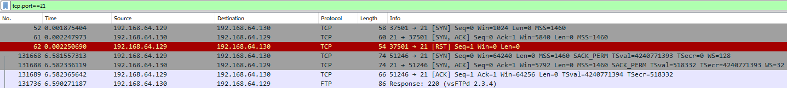

# STMCTF23 QUESTION

## Information
### Challenge name: 

`trafik_analizi`

### Categories:
 - `forensic`

### Challenge message:
```
TR:
Metasploit framework ile ftp servisi kullanılarak komut çalıştırmak için açılmıl backdoorun portu nedir?
EN:
What is the port of backdoor for executing commands using ftp service with Metasploit framework?

TR:
Zafiyetli servisin ismi nedir?
EN:
What is the name of vulnerable service?

TR:
Zafiyetli servisin versiyonu nedir?
EN:
What is the version of vulnerable service?

TR:
İlgili zafiyetin CVE kodu nedir?
EN:
What is the CVE code of the relevant vulnerability?
```

---

## Solution - TR:

TR:
Metasploit framework ile ftp servisi kullanılarak komut çalıştırmak için açılmış backdoorun portu nedir?

İlk olarak tcp.port==21 filtresi uygulanır. Servis bilgisi gözlemlenir.



Servis bilgisine ait exploit araştırılır.
https://github.com/rapid7/metasploit-framework/blob/master//modules/exploits/unix/ftp/vsftpd_234_backdoor.rb
https://www.exploit-db.com/exploits/49757

Komut çalıştırmak için açılmış 6200 nolu port aşağıdaki şekilde tespit edilmiştir:
```
  def exploit

    nsock = self.connect(false, {'RPORT' => 6200}) rescue nil
    if nsock
      print_status("The port used by the backdoor bind listener is already open")
      handle_backdoor(nsock)
      return
    end
```

TR:
Zafiyetli servisin ismi nedir?

tcp.port==21 filtresi uygulandıktan sonra 3'lü el sıkışma sağlandıktan sonra servis bilgisi gözükmetedir. Cevap: vsFTPd


TR:
Zafiyetli servisin versiyonu nedir?

tcp.port==21 filtresi uygulandıktan sonra 3'lü el sıkışma sağlandıktan sonra servis bilgisi gözükmetedir. Cevap: 2.3.4


TR:
İlgili zafiyetin CVE kodu nedir?

İlk olarak tcp.port==21 filtresi uygulanır. Servis bilgisi gözlemlenir.


Servis bilgisine ait exploit araştırılır.
https://github.com/rapid7/metasploit-framework/blob/master//modules/exploits/unix/ftp/vsftpd_234_backdoor.rb
https://www.exploit-db.com/exploits/49757

Exploit-db'ye ait linkte CVE kodu CVE-2011-2523 olarak aşağıdaki şekilde tespit edilmiştir:
```
# Exploit Title: vsftpd 2.3.4 - Backdoor Command Execution
# Date: 9-04-2021
# Software Link: http://www.linuxfromscratch.org/~thomasp/blfs-book-xsl/server/vsftpd.html
# Version: vsftpd 2.3.4
# Tested on: debian
# CVE : CVE-2011-2523
```

---

## Solution - EN:

EN:
What is the port of backdoor for executing commands using ftp service with Metasploit framework?

First, the tcp.port==21 filter is applied. Service information is observed.


Exploit related to service information is investigated.
https://github.com/rapid7/metasploit-framework/blob/master//modules/exploits/unix/ftp/vsftpd_234_backdoor.rb
https://www.exploit-db.com/exploits/49757

Port 6200, which was opened to run commands, was determined as follows:
```
  def exploit

    nsock = self.connect(false, {'RPORT' => 6200}) rescue nil
    if nsock
      print_status("The port used by the backdoor bind listener is already open")
      handle_backdoor(nsock)
      return
    end
```

EN:
What is the name of vulnerable service?

After applying the tcp.port==21 filter, service information appears after a 3-way handshake is achieved.
Answer: vsFTPd


EN:
What is the version of vulnerable service?

After applying the tcp.port==21 filter, service information appears after a 3-way handshake is achieved.
Answer: vsFTPd


EN:
What is the CVE code of the relevant vulnerability?

First, the tcp.port==21 filter is applied. Service information is observed.


Exploit related to service information is investigated.
https://github.com/rapid7/metasploit-framework/blob/master//modules/exploits/unix/ftp/vsftpd_234_backdoor.rb
https://www.exploit-db.com/exploits/49757

In the link to Exploit-db, the CVE code was detected as CVE-2011-2523 as follows:

```
# Exploit Title: vsftpd 2.3.4 - Backdoor Command Execution
# Date: 9-04-2021
# Software Link: http://www.linuxfromscratch.org/~thomasp/blfs-book-xsl/server/vsftpd.html
# Version: vsftpd 2.3.4
# Tested on: debian
# CVE : CVE-2011-2523
```


