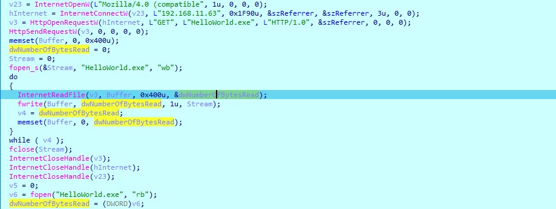
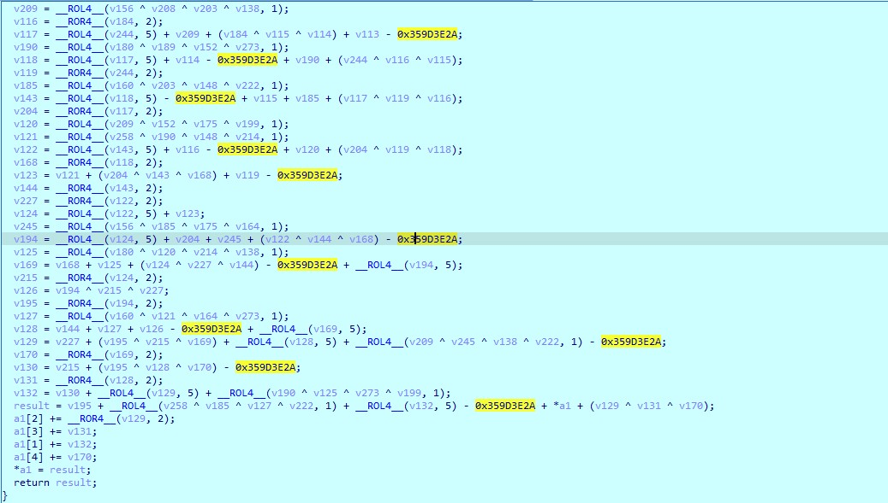
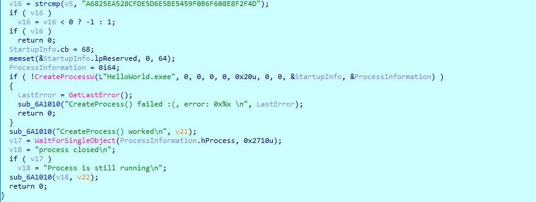
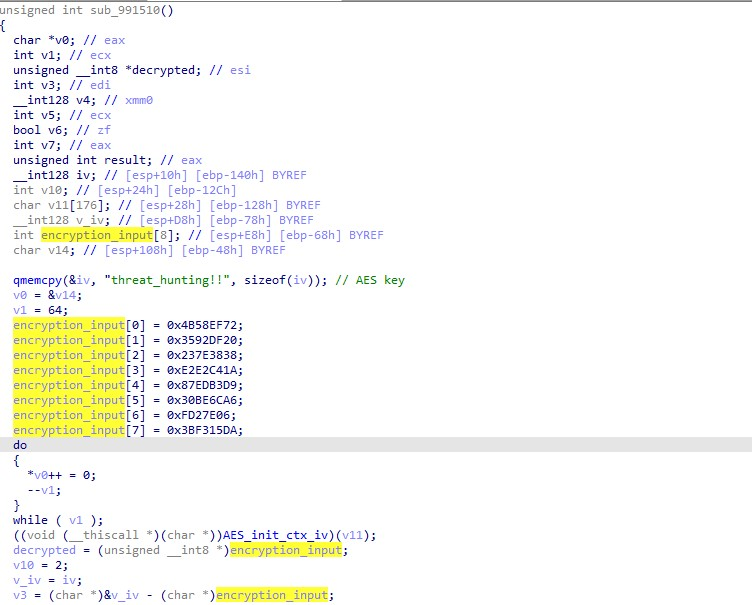
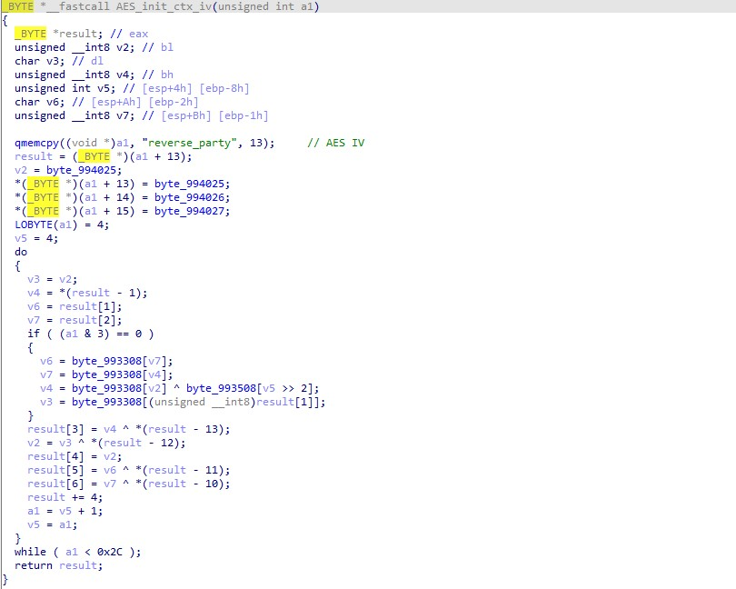
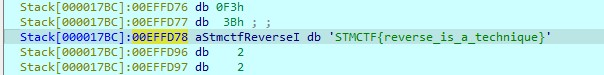

# STMCTF23 QUESTION

## Information
### Challenge name: 

`Bakış Açısı`

### Categories:
 - `Reverse`

### Challenge message:
```
TR : Elimizde başarısız bir kampanyaya ait bir zararlı yazılım bulunmaktadır. Komuta kontrol adresi kapatılmış ve elimizde sadece ilk adıma ait zararlı yazılım indiren dosya bulunmaktadır. Olay müdahale sürecini yürütmemizde bize yardımcı olur musun ?

EN : We have malware from a failed campaign. The command and control address is down and we only have the malware download file from the first step. Can you help us with the incident response process?

```

---

## Solution:

Komuta kontrol adresinden dosya indirme ve dizine yazma işleminin yapıldığı görülmektedir.



İndirilen dosyanın sha1 hash değeri kontrol edilmektedir. Komuta kontrol adresi kapatıldığı için dosyaya erişimimiz bulunmamaktadır. Ama bir daha önce bir siber güvenlik analistinin internet ortamına attığı düşünülerek, sha1 hash değeri araştırılmıştır ve VirusTotalde dosya bulunmuştur.




İnternet ortamından indirilen dosya, incelendiğinde içerisinde gömülü olan verinin AES şifreleme algoritması ile şifrelendiği ve debug edip çözmemiz gerektiği anlaşılmaktadır.




