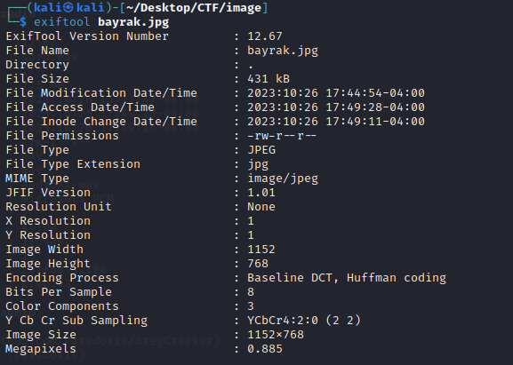
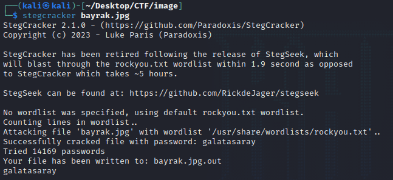
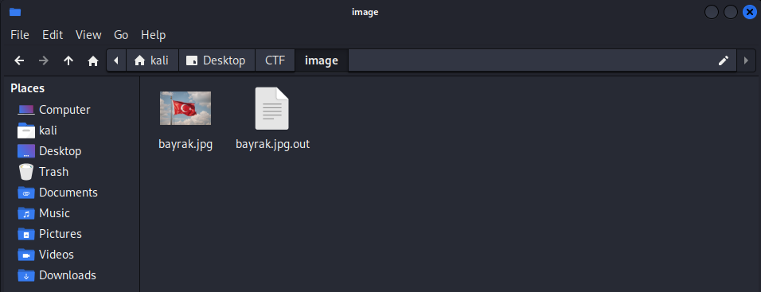
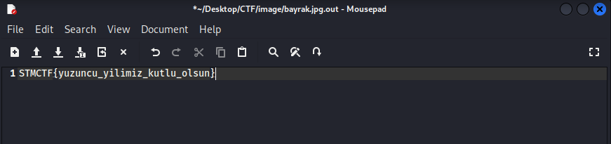

# STMCTF23 QUESTION

## Information
### Challenge name: 

`Ancestral Heirloom - Flag`

### Categories:
 - `MISC`

### Challenge message:
```
TR:
Türkçe soru metni
Atalarımız, dünyanın en asil, en ihtişamlı ve en görkemli bayrağının, bayrağımızın, içinde bize bir mesaj göndermişler. 
100 yıl evvelinden gelen bu mesajı çözmemizde bize yardım eder misin?

EN:
English question text
Our ancestors sent us a message inside the most noble, magnificent and majestic flag in the world, our flag. 
Can you help us decipher this message from 100 years ago?
```

## Solution - TR:











---

## Solution - EN:


