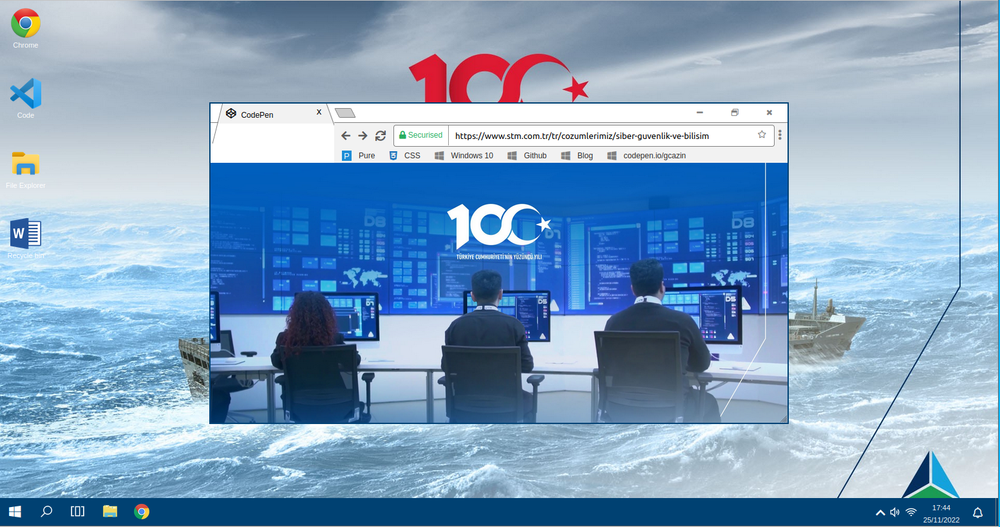

# STMCTF23 QUESTION

## Information
### Challenge name: 

`Windows 10`

### Categories:
 - `MISC`

### Challenge message:
```
windows10.stmctf.com
```

---

## Solution - TR:

Açıklamadaki linke gidilir. Karşımıza bir windows 10 giriş sayfası gelir.


Herhangi bir yere tıklandığında ya da herhangi bir tuşa basıldığın şifre girme bölümü ve kullanıcı profil fotoğrafı açığa çıkar.


Profil fotoğrafındaki qr code taratılır.


QR Code dan çıkan base64 şifreli kod decode edilir.


Bulunan sonuç ile windows'a giriş yapılır. Masaüstü gezilirken chrome açıldığında içeride giriş ve masaüstü ekranlarından farklı olarak STM Siber Füzyon Merkezinden bir fotoğraf görülür.



Fotoğraf indirilerek exiftool çıktısı kontrol edildiğinde flag'e ulaşılır.


---

## Solution - EN:

Go to the link in the description. A Windows 10 login page appears.


When you click anywhere or press any button, the password entry section and user profile photo are revealed.


The QR code in the profile photo is scanned.


The base64 encrypted code resulting from the QR Code is decoded.


You can log in to Windows with the result found. When Chrome is opened while browsing the desktop, a photo from the STM Cyber Fusion Center is displayed, unlike the login and desktop screens.


The flag can be accessed by downloading the photo and checking the exiftool output.


