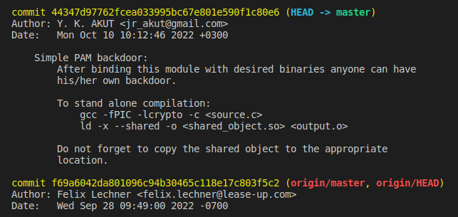
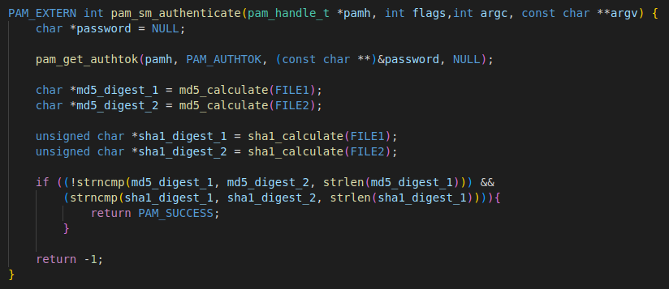
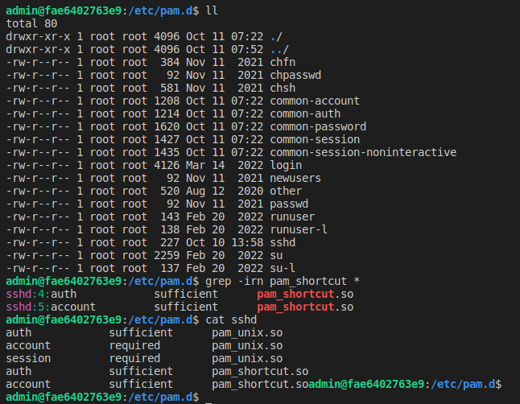
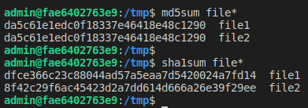
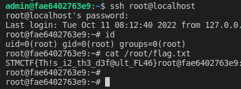

# STMCTF23 QUESTION

## Information
### Challenge name: 

`Backup Me`

### Categories:
 - `Pwn`

### Challenge message:
```
TR:
Şirket çalışanlarından birinin gizli projelerle ilgili dışarıya bilgi sızdırdığı fark edilmiştir, fakat henüz kim olduğu ve nasıl yapıldığı tam olarak bilinmemektedir. Olağan şüphelilerden biri olan yazılımcının, geliştirme makinesine yetkili erişim izni için bir backdoor koymuş olabileceği düşünülmektedir. Bu backdoor'u bulma konusunda bize yardım edebilir misin?

EN:
It has been noticed that one of the employees of the company has been leaking information about confidential projects, but it is not yet known exactly who he is and how he did it. It is thought that a software developer, who is one of the usual suspects, may have put a backdoor for authorized access to the development machine. Can you help us find this backdoor?
```

## Solution:

2022 portundan hizmet veren ssh servisine **admin:admin** bilgileriyle bağlantı kurulur (SSH BruteForce yapılıbilir).

admim kullanıcısının /home dizini altındaki /development/linux-pam projesine baklıldığında versiyon takibi için git kullanıldığı görülüyor. Git kayıtlarına bakıldığında ise bir backdoor commit'i bulunacaktır.



Eklenen **pam_shortcut.c** dosyası incelendiğinde bu modülün md5 değerleri aynı fakat sha1 değerleri farlı iki dosyanın var olup olmamasına göre PAM kimlik doğrulaması yaptığı görülebilmektedir. **/tmp/** altına koyulacak **file1** ve **file2** dosyalarıyla PAM üzerinden kimlik doğrulaması yapılabilmektedir.



Derlenen bu modülün hangi binary yada servis ile birlikte kullanıldığını bulmak için **/etc/pam.d/** altındaki konfigürasyon dosyaları incelenir. Ve **sshd** dosyasının yeni derlenen **pam_shortcut.so** modülünü kullandığı görülür.



pam_shortcut üzerinden sisteme yetkili şekilde giriş yapmak için MD5 değerleri aynı SHA1 değerleri farklı iki dosya hazırlanarak **admin** kullanıcısı ile **/tmp/file1** ve **/tmp/file2** olarak yüklenir.



Bundan sonra yapılması gereken tek şey sisteme **ssh root@localhost** ile login olmaktır. Bayrak /root/flag.txt adresindedir.

