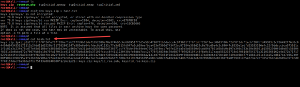

# STMCTF23 QUESTION

## Information
### Challenge name: 

`devel`

### Categories:
- `WEB/PWN`

### Challenge message:
```
devel.stmctf.com
```

## Solution:
#### 1.	BİLGİ TOPLAMA > Aktif Tarama
Hedef makinede çalışan servisleri bulmak ve varsa bilinen herhangi bir güvenlik açıklarını bulmak için, varsayılan betik (-sC) ve servis dökümü alma (-sV) bayraklarıyla çalışan nmap taramayla hedef hakkında bilgi toplamaya başlayalım:


Aktif tarama bize TCP/21 (FTP), TCP/22(SSH) ve TCP/80 (Apache Web Server) portlarının ve üzerinde çalışan servislerinin açık olduğunu gösteriyor.


#### 2.	KEŞİF YAPMA > Dosya ve Dizin Keşfi
Kutuda bulunan dosyaları ve dizinleri keşfetmek için gobuster kullanarak php, html ve txt uzantılarını kullanarak erişilebilir web uygulama dosyalarını ve dizinlerini tarıyoruz:


Dizin ve dosya taraması, _dev isimli ilginç bir dizin sağlar, böylece bu dizinin altındaki dizinleri ve dosyaları keşfetmek için tekrar gobuster'ı çalıştırabiliriz:


Bu sefer _dev dizini altında taramamız sonucu, geliştiricilerin kodlarını test etmeleri için bir test dizini gibi görünen başka bir dizini testing ismiyle ortaya çıkartıyor. Öyleyse FTP servisinin araştırılmasına devam edelim:


Nmap, FTP için anonim girişlerin etkinleştirildiğini ortaya çıkardığında, dosyaları yükleyebileceğimiz herhangi bir dizinimiz olup olmadığını kontrol ederiz. Şansımıza, web sunucusunda da bulduğumuz, yazılabilir olarak testing dizinimiz var:


Testing web sunucusundaki ile aynı dizin gibi görünüyor. Bu yüzden oraya bir php web shell yüklersek ve sonra bir reverse shell elde etmek için web sunucusundan bu reverse shell dosyasına erişebilir ve Kali’mize bağlantı tetikleyebiliriz.


#### 3.	KAYNAK GELİŞTİRME > Kabiliyet Elde Etme: Exploit’ler
Kısaca, testing dizini hem WEB hem de FTP hizmetlerine hizmet verecek şekilde yapılandırılmıştır! İstismarımızı başlatmak için, ilk önce FTP kullanarak sunucuya web shell dosyası yüklemeye başlayabiliriz:


PHP reverse shell (web shell) dosyasında IP ve port bilgilerini değiştiriyoruz:


reverse.php dosyasını testing dizinine yerleştiriyoruz:


Şimdi buna web tarayıcısından erişmeli ve netcat dinleyicimizde shell almalıyız. Bir dinleme soketi açın ve reverse.php dosyasını tıklayın:


Shell çalışıyor. Güzel! www-data kullanıcısı adıyla hedef sistemde standart kullanıcı yetkileriyle erişim kazandık:


Bir süre ilginç dosyalar için makineyi inceledikten sonra, alışılmadık bir şekilde /var/backups/ dizininde keys.zip dosyası olduğunu gördük:


Şimdi saldırgan makinemizde bir dinleyici başlatıp, çıktıyı bir dosyaya yönlendirip ardından zafiyetli makinede ise netcat kullanarak girdiyi keys.zip dosyası olarak alacak şekilde yönlendirerek görevi tamamlıyoruz:
Kali Linux’teki dinleme noktamız:


Keys.zip dosyasını zafiyetli kutudan Kali'ye aktarmak için netcat komutu:


Başarılı aktarımı test etmek için md5sum kullanabiliriz çünkü netcat bazen güvenilmez olabiliyor:


Zafiyetli kutudaki keys.zip dosyasının hash değeri, Kali Linux'ta indirilen keys.zip ile eşleşmelidir:


#### 4.	İLK ERİŞİM > Geçerli Hesaplar: Yerel Hesaplar
Zip dosyasını indirdikten sonra parola korumalı olduğunu görüyoruz, böylece johntheripper'ı parolayı kırmak için kullanabiliriz, böylece rockyou.txt parola listesini kullanarak zip içeriğini görebiliriz:




keys.zip dosyasının parolası: supermocel
Zip dosyasını çıkardıktan sonra, intern kullanıcısı için SSH anahtarları içerdiğini bulduk. Bu anahtarları kutuya giriş yapmak ve intern kullanıcısının sahip olduğu tüm yetkileri almak için kullanabiliriz ve dolayısıyla kutuda başka bir intern kullanıcı yetkilerine sahip olabiliriz.


İşte bu SSH açık anahtarının intern kullanıcı oturumu için olduğunun kanıtı:


Artık intern kullanıcı yetkisiyle user.txt dosyasını okuyabiliyoruz:


#### 5..	YETKİ YÜKSELTME > Yetki Yükseltme Kontrol Mekanizmasını Kötüye Kullanma: Setuid ve Setgid
Dizini Kali Linux'ta betiğimizin bulunduğu HTTP sunucusu olarak ayarlama komutu:


Betiği Kali'deki HTTP sunucusundan zafiyetli kutuya indirip çalıştırıyoruz:


Döküm alma betiğini çalıştırdıktan sonra, sed'in setuid bit setine sahip olduğunu görebiliriz, böylece sed'i root erişimi elde etmek için kullanabiliriz:


Find komutunu uygun parametrelerle çalıştırdığımızda, komut çıktısının sed binary’sinin gerçekten SUID bitinin ayarlandığını göstermektedir. Sh ile sed kullandığımızda şansımıza herhangi bir kodu çalıştırmamıza izin vermeden önce yetki düşmektedir:


Şimdi root yetkilerine sahip başka bir kullanıcı oluşturmak için /etc/passwd dosyasını değiştirmek gibi başka yollarla sed'i istismar etmemiz gerekir:


Yani temelde bu yöntemde openssl kullanarak bir parola hash değeri oluşturuyoruz ve sonra /etc/passwd dosyasını ürettiğimiz hash ile başka bir kullanıcı eklemek için güncelliyoruz. Öyleyse önce hash'i oluşturalım:


```
$1$xyz$cEUv8aN9ehjhMXG/kSFnM1
```

Artık /etc/passwd dosyasını sed kullanarak değiştirebiliriz ve kullanıcıyı yukarıda oluşturulan hash ile birlikte ekleyebiliriz. 
Secret_user oluşturduk ve şifresi aşağıdaki sed komutunda belirtilen şifredir. Şimdi root yetkilerini elde etmek için bu secret_user hesabını kullanarak giriş yapabiliriz. Ve şimdi kutuyu root seviyesi yetkileriyle tamamen ele geçirdik:

```
sed -i ‘$ a secret_user:\$1\$xyz\$cEUv8An9ehjhMXG\/kSFnM1:0:0:root:\/root:\/bin\/bash’ /etc/passwd
```

Bu da kanıt olarak root.txt dosyasının içeriğidir.


