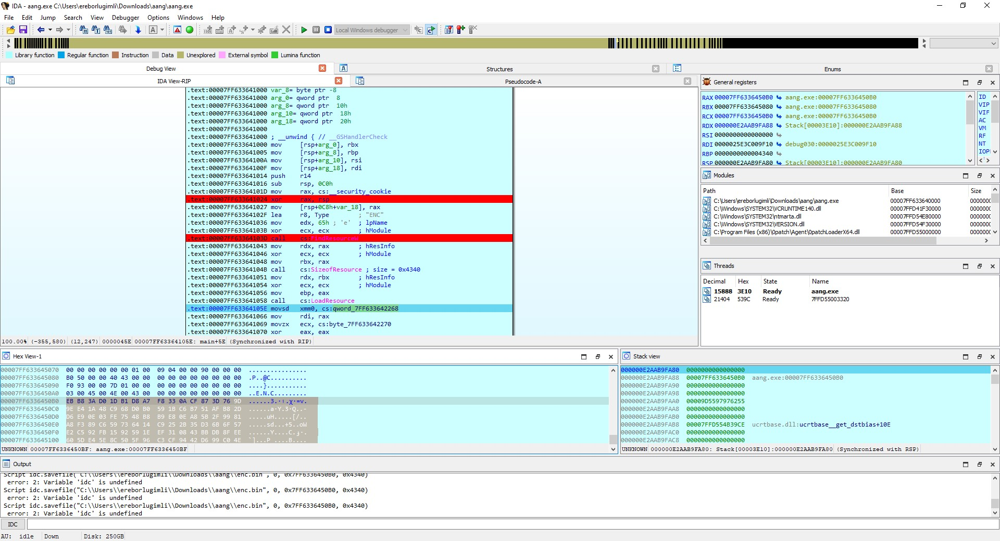
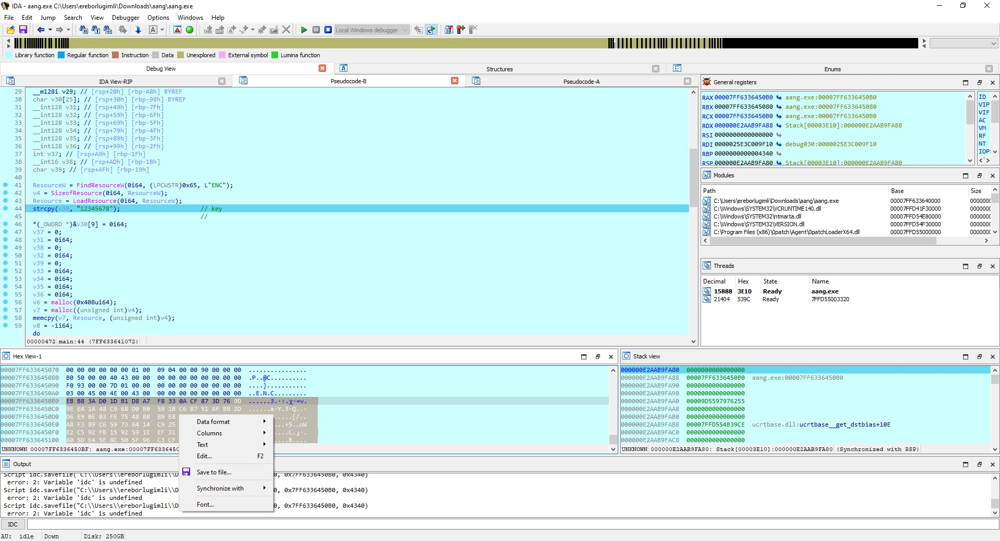
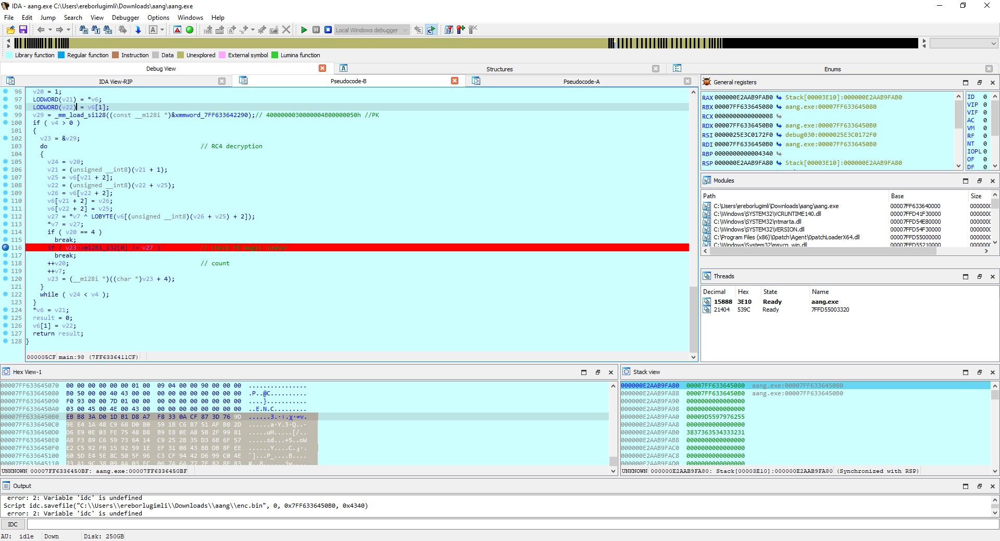
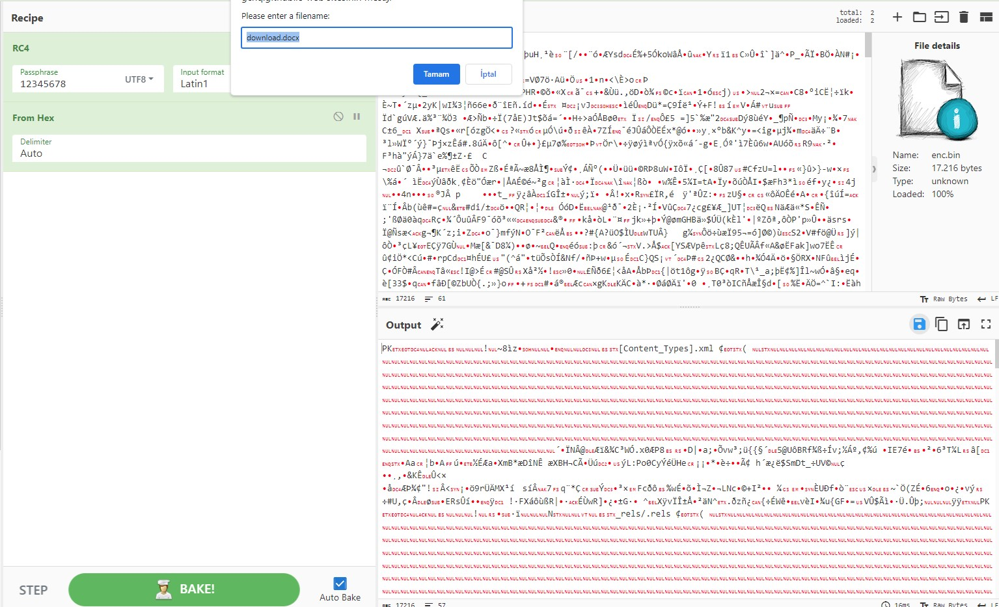
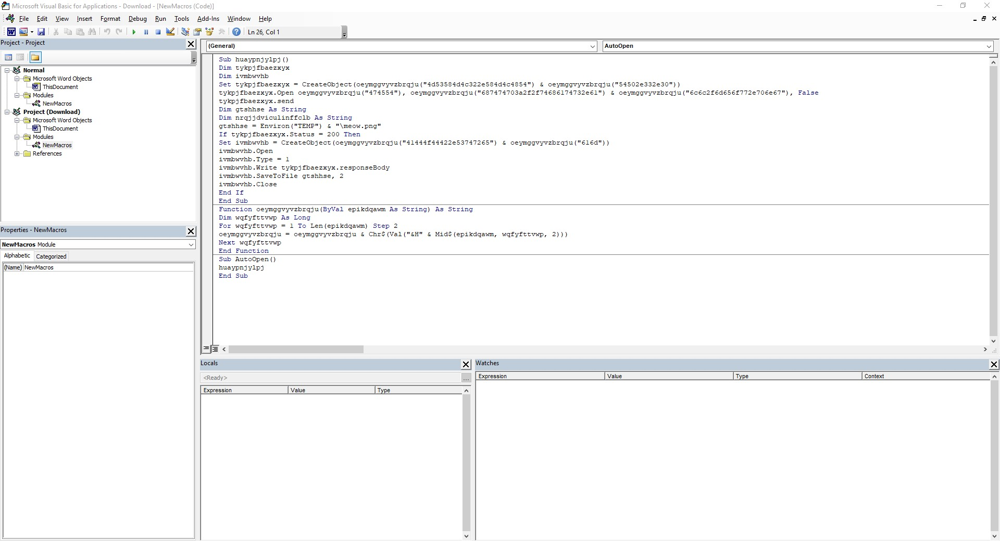
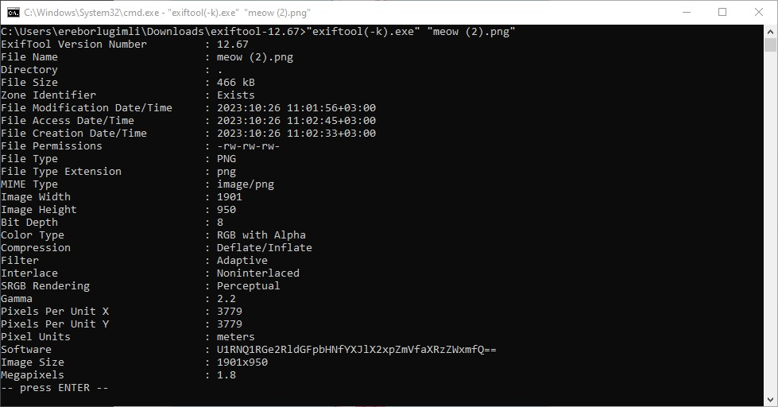
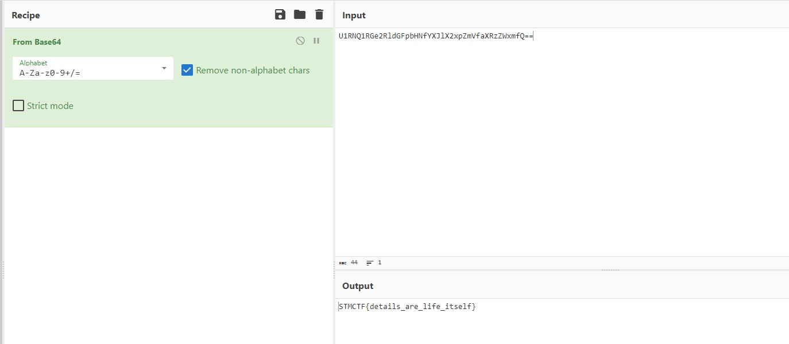

# STMCTF23 QUESTION

## Information
### Challenge name: 

`aang`

### Categories:
 - `Reverse`

### Challenge message:
```
TR:


EN:

```

---

## Solution:

Dosyanın "ENC" adında resource bölümününün olduğu ve memorye yüklendiği görülmektedir.



Bu verinin RC4 ile şifrelendiği görülmektedir.



RC4 ile şifrelenen verinin sadece ilk 4 bytenın çözümlenmeye çalışıldığı görülmektedir. 



Çözülen byteler internet ortamında araştırıldığında 50 4B 03 04
(PK) zip dosya formatında bir dosya olduğu anlaşılmaktadır.

Dosya indirilip cyberchef ile çözümlendikten sonra kaydedilkten sonra docx dosyası olduğu görülmektedir.



Dosya office ortamında açılmaya çalışıldığında hata alınmaktadır, o zaman docx uzantına sahip olmadığı anlaşılmaktadır. Zip dosyasına çevirilerek dosya içeriğine bakıldığında macro olduğu görülmektedir. Bu sebeble, dosya uzantısı docm olarak değiştirilir.  

İçerisindeki obfuscation edilmiş macro çözümlendiğinde TEMP dizinine resim dosyası indirilmeye çalışıldığı görülmektedir.



İndirlen resim dosyası exiftool ile incelendiğinde Software kısmında base64 ile şifrelenmiş bir verinin olduğu görülmektedir.



Şifrelenen veri çözüldüğünde flag elde edilmektedir. 

