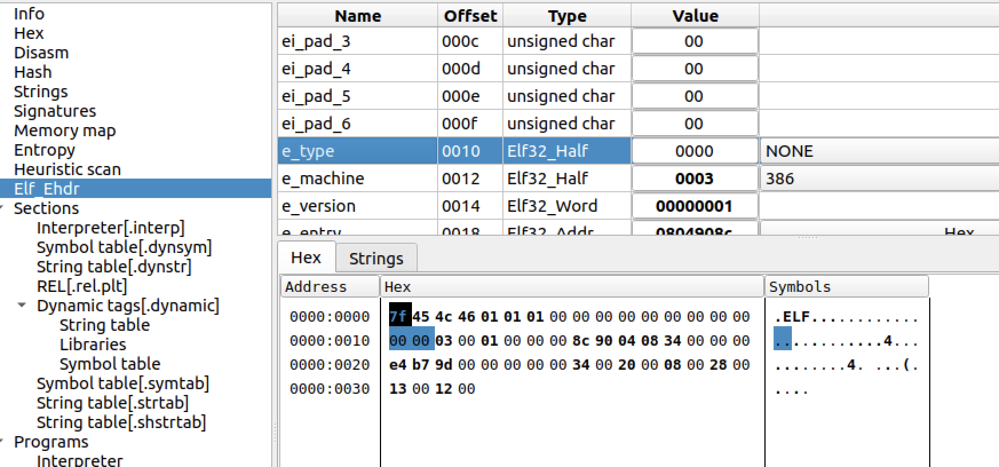
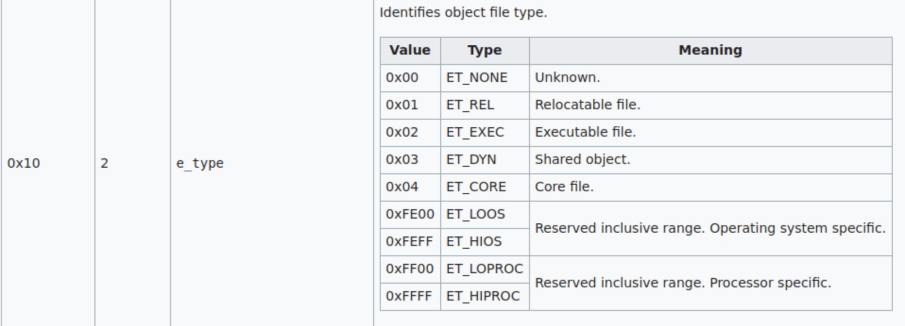
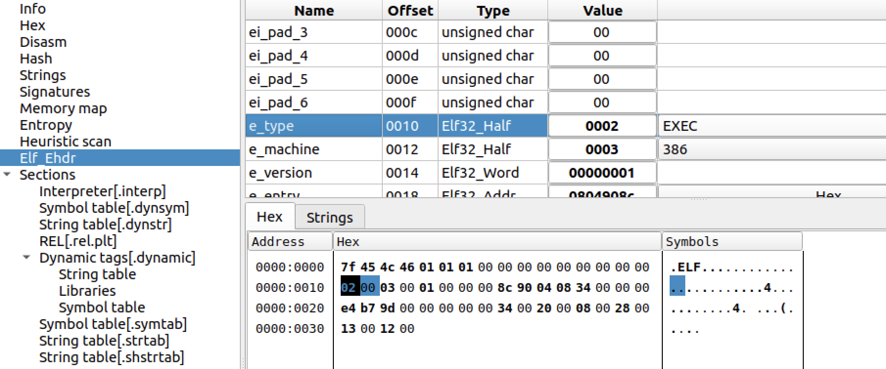
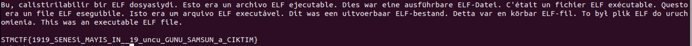

# STMCTF23 QUESTION

## Information
### Challenge name:

`aobe`

### Categories:
`Reverse`

### Challenge message:fexe
```
TR:
Çalıştırılabilir bir ELF dosyasıydı, bir bitini değiştirdik, artık çalışmıyor.

EN:
It was an executable ELF file; we changed one bit, and now it doesn't work.
```


## Solution:
```
./aobe
bash: ./aobe: cannot execute binary file: Exec format error
```

```
file aobe
aobe: ELF 32-bit LSB no file type, Intel 80386, version 1 (SYSV)
```



https://en.wikipedia.org/wiki/Executable_and_Linkable_Format

e_type  0x10  2 bytes

0x00	ET_NONE	Unknown.

0x02	ET_EXEC	Executable file.






```
file aobe
aobe: ELF 32-bit LSB executable, Intel 80386, version 1 (SYSV), dynamically linked, interpreter /lib/ld-linux.so.2, not stripped
```
---
