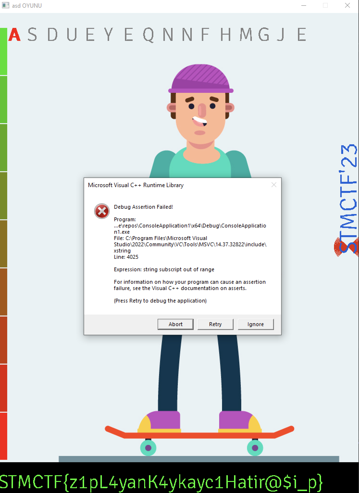

# STMCTF QUESTION

## Information
### Challenge name:

`asd`

### Categories:
`Reverse`

### Challenge message:
```
TR:
Oyunu başlat, zaferi yakala.

EN:
Game on and claim victory.
```

---

## Solution:
```
Oyun calisitirilinca no licence hatasi gelir. Basit bir JMP islemi gecilince oyun basliyor.

Daha sonra debug islemlerinde bir iki daha antidebug teknigi var.

Sonra loop icindeki uygun degerin artisini her loop da olacak sekilde yapinca flag cikiyor.
```


