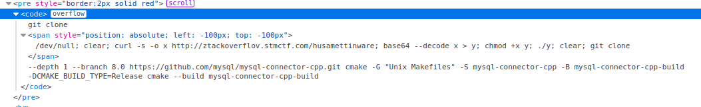
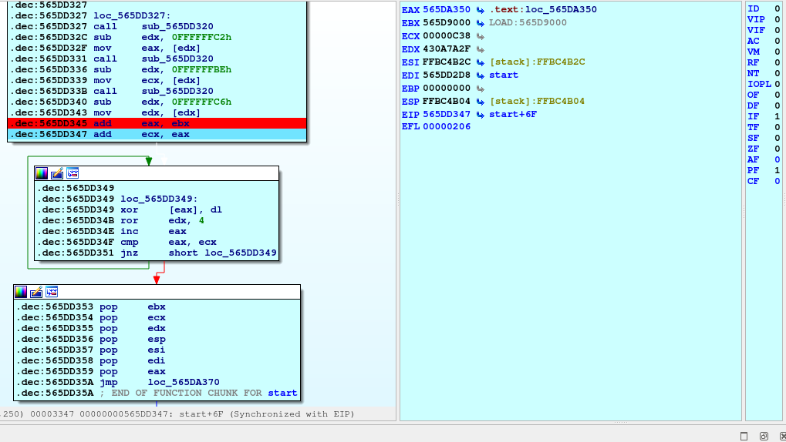
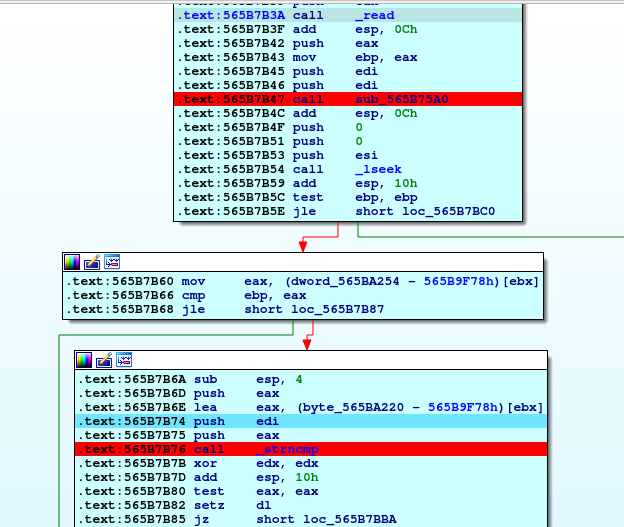
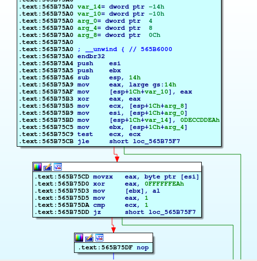

# STMCTF23 QUESTION

## Information
### Challenge name: 

`husamettinware`

### Categories:
 - `reverse`
 - `linux`
 - `malware`
 - `ransomware`

### Challenge message:
```
TR:
Tarayıcıdan kod kopyala yapıştır yapmayın!

EN:
Do not copy paste code from browser.

```

## Solution:

Kırmızı çerçeveli kısımda görünürde kod gözükmese de span tag'i ile kod saklanmıştır. Kullanıcı code tag'i ile olan kısmı kopyaladığında görmediği kod da clipboard'a geçmiş olur. Kullanıcı bu kısmı görmediği için konsola yapıştırdığında görmediği kod da çalışmaktadır:



base64 ile encode edilmiş dosya önce curl ile çekilip, decode edildikten sonra çalıştırılmaktadır. Bu dosya yine curl ile çekilip incelenmesi gerekmektedir.

Dosya şüpheli olduğundan izole bir sanal makinede incelenmelidir.

Dosya çalıştırıldığında şu hatayı vermektedir:

    $ ./husamettinware 
    folder not found: /home/xxxx/stmctf22-husamettinware


Bu klasör yaratılır ve tekrar çalıştırılır:

    $ mkdir ~/stmctf22-husamettinware && ./husamettinware 
    No file to encrypt.


Zararlı bir fidye yazılımıdır. Bu klasör altında bazı dosyalar aramaktadır. Test amaçlı bu klasör altına bir dosya konulur:

    $ dd if=/dev/urandom of=~/stmctf22-husamettinware/test bs=1K count=1 oflag=sync
    $ ./husamettinware 
    Husamettin was here.
    Encrypted file count: 1


Bu işlem sonrası daha önceden yaratılan klasör incelenir:

    $ ls stmctf22-husamettinware
    ransomnote.txt  test.husamettin

ransomnote.txt dosyası içerisinde bazı dosyaların içeriğine göre şifrelenmediği görülür. Hangi dosyaların şifrelenmediğini bulmak için zararlı ida üzerinde açılır. Uygulama paketlendiği için unpack kodları incelenir:




EDX register'ında key olmak üzere text section'ın XOR ile açıldığı görülür. (key=0x430A7A2F len=0x00000C38)

text section'ı aşağıdaki script ile bir dosyaya açılır ve dosyanın entrypoint'i .text section'ı olacak şekilde güncellenir:

```
import lief

def ror32(num, cnt):
    return (num >> cnt)|(num << 32 - cnt) & 0xFFFFFFFF


# parse elf file
elf_file = lief.parse('solution/husamettinware')

# find text section
text_section = elf_file.get_section('.text')
if text_section is None:
    print('Unable to find text section.')
    exit(1)

key = 0x430a7a2f
# unpack

with open('solution/text_section.bin', 'wb') as fd:
    for idx, byte in enumerate(text_section.content):
        #print('0x{0:0{1}X}'.format(key, 8))
        key_byte = key & 0xff
        val = key_byte ^ byte
        key = ror32(key, 4)
        fd.write(val.to_bytes(1, 'little'))

elf_file.header.entrypoint = text_section.offset
elf_file.write('solution/husamettinware.unpacked')
```


.text section'ı güncellenir:

    $ objcopy --update-section .text=text_section.bin husamettinware.unpacked


Güncellenen dosya üzerinde artık analiz gerçekleştirilebilir. Fidye yazılımının dosyaları okuduktan sonra şifrelediğini bilindiğinden, read sistem çağrısının yapıldığı yerleri incelendiğinde dosya içeriğinin kontrolünün yapıldığı fonsiyon da bulunmuş olur.Fonksiyonun içerisi incelendiğinde strncmp ile karşılaştırma yapıldığı görülür:




Fakat strncmp ile karşılaştırma yapılmadan önce, dosya içeriği önce bir fonksiyona uğrayıp encrypt edildikten sonra karşılaştırma yapılır. Dolayısıyla dosya içeriği kontrolü bellek üzerinde açık değildir. Bu fonksiyonun nasıl bir şifreleme yaptığının bulunması gerekmektedir:




KEY:0xeaddccde olacak şekilde xor kullanılmaktadır. strncmp yapılan yere tekrar breakpoint konup veriler cyberchef üzerinde bu key ile decode edilir:

    95 98 80 98 - .ELF // elf dosyaları
    a9 99 fc ee db - CD001 // ISO dosyaları
    b9 89 81 9d be 9b b7 9d da b3 8b ac de a9 b6 ff b3 ed b9 81 de af ff 81 99 88 af 96 b5 e9 a2 81 de 93 ad 92 93 8e 98 8a cb a0 - STMCTF{C0nGr4tz!Y0u_4r3_sUcH_4n_4NaLySTT!} // flag
